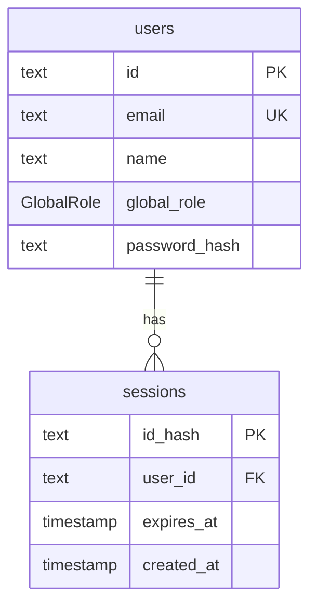

# Database

PostgreSQL 16 in Docker, accessed through Prisma 7 (`apps/api/prisma`).
The full entity plan (ERD) is in [phases/phase-0-architecture.md §10](phases/phase-0-architecture.md#10-database-erd-proposal).

## Databases

| Name        | Used by                           | Reset how                                                   |
| ----------- | --------------------------------- | ----------------------------------------------------------- |
| `qawm_dev`  | `npm run dev`, Prisma Studio      | `npm run db:reset` (destructive, asks nothing, your call)   |
| `qawm_test` | Playwright runs (`NODE_ENV=test`) | Migrated and seeded automatically before each `npm run e2e` |

Both live in the same Docker container (`qawm-postgres`). `docker/postgres/init/01-create-test-db.sql`
creates `qawm_test` the first time the volume is created.

## Current schema (Phase 1)

| Table   | Columns                                                                                           | Notes                                |
| ------- | ------------------------------------------------------------------------------------------------- | ------------------------------------ |
| `users` | `id` (cuid), `email` (unique), `name`, `global_role` (`ADMIN`/`USER`), `created_at`, `updated_at` | Password + sessions added in Phase 2 |

Conventions:

- Prisma models are `PascalCase`, tables and columns are `snake_case` (`@@map`, `@map`).
- Primary keys are `cuid` strings; human-readable keys (`BUG-7`) arrive with each entity.
- Timestamps are `timestamp(3)` in UTC.

## Phase 2: Authentication

Planned in [phases/phase-2-plan.md](phases/phase-2-plan.md); how the API uses these tables is in
[DD-AUTH-01](design/detail/logic/DD-AUTH-01-session.md). Migration name: `add_auth`.

| Table      | Column          | Type           | Null | Notes                                                        |
| ---------- | --------------- | -------------- | ---- | ------------------------------------------------------------ |
| `users`    | `password_hash` | text           | yes  | argon2id hash (BR-AUTH-12). Null means the user can't log in |
| `sessions` | `id_hash`       | text, PK       | no   | SHA-256 (hex) of the token in the cookie (BR-AUTH-15)        |
| `sessions` | `user_id`       | text, FK users | no   | `ON DELETE CASCADE`; index on `user_id`                      |
| `sessions` | `expires_at`    | timestamp(3)   | no   | login time + `SESSION_TTL_HOURS` (BR-AUTH-05)                |
| `sessions` | `created_at`    | timestamp(3)   | no   | default `now()`                                              |



Seed: every seed user gets the password `Password123!` (dev and test only). Phase 2 also adds
`ratelimit@qawm.test` (Rate Limit, USER), used only by rate-limit tests.

## Migrations

```bash
# 1. Edit apps/api/prisma/schema.prisma
# 2. Create + apply a migration to qawm_dev (give it a meaningful name)
npm run db:migrate -- --name add_user_password
# 3. Commit the generated folder in apps/api/prisma/migrations/
```

- Never edit a migration that has been committed and applied; create a new one.
- `npm run db:migrate` also regenerates the Prisma client (`apps/api/src/generated`, git-ignored).
- Test DB: `npm run db:test:prepare -w @qawm/api` applies migrations and seeds (Playwright runs this for you).

## Seed data

`apps/api/prisma/seed/` is deterministic and idempotent (upserts by unique keys), so it is safe to run repeatedly.

| Email            | Name       | Global role | Persona     |
| ---------------- | ---------- | ----------- | ----------- |
| admin@qawm.test  | Ada Admin  | ADMIN       | Admin       |
| lead@qawm.test   | Minh Lead  | USER        | QA Lead     |
| linh@qawm.test   | Linh QA    | USER        | QA Engineer |
| dev@qawm.test    | Dev Nguyen | USER        | Developer   |
| viewer@qawm.test | Pat Viewer | USER        | Viewer      |
