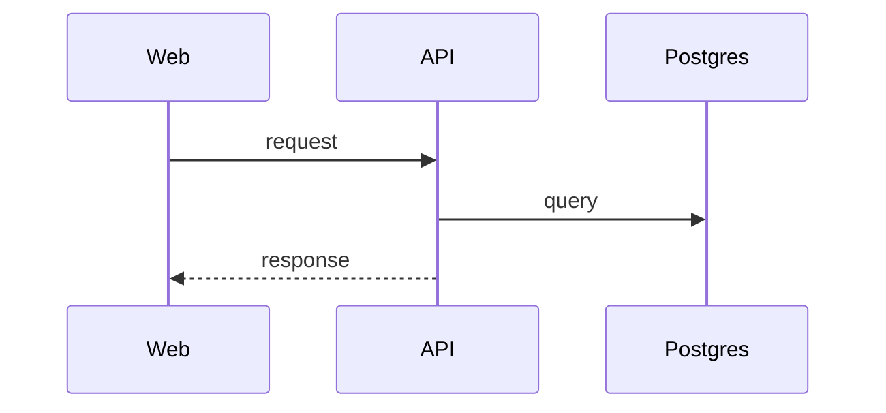

# DD-<FEATURE>-NN <Topic>

How it works inside: modules, data, algorithm, edge cases.

## Sequence

## Rules in code

| Topic | Behaviour | Rule |
| ----- | --------- | ---- |

## Change log

| Date | Change | Why |
| ---- | ------ | --- |
