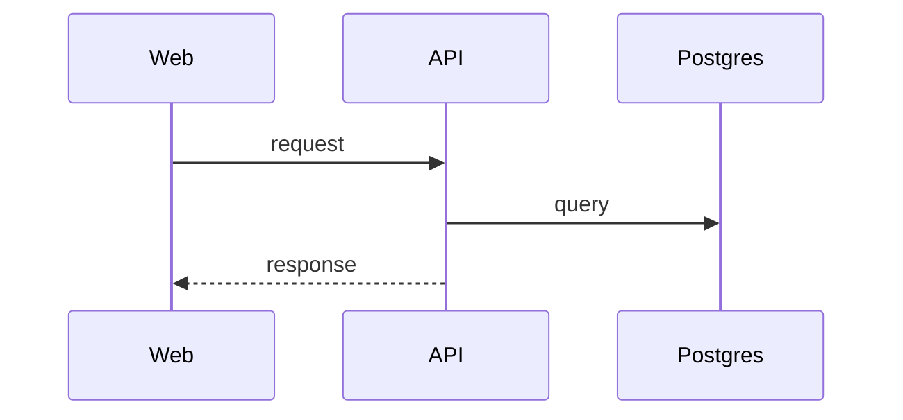

# DD-<FEATURE>-NN <Topic>

How it works inside (IEEE 1016 design viewpoint in the front matter): modules, data, algorithm, edge cases.

## Sequence

<!-- Add a "## State" section with a Mermaid stateDiagram-v2 when something has a lifecycle. -->

## Rules in code

| Topic | Behaviour | Rule |
| ----- | --------- | ---- |

## Errors

| Situation | What the code does | Status / message |
| --------- | ------------------ | ---------------- |

## Security

Who may call this, what is checked, what must never leak (OWASP Top 10 / API Security Top 10).

## Testability

Seed data, settings or hooks that let tests reach every branch, and which branches only unit tests can reach.

## Change log

| Date | Change | Why |
| ---- | ------ | --- |
