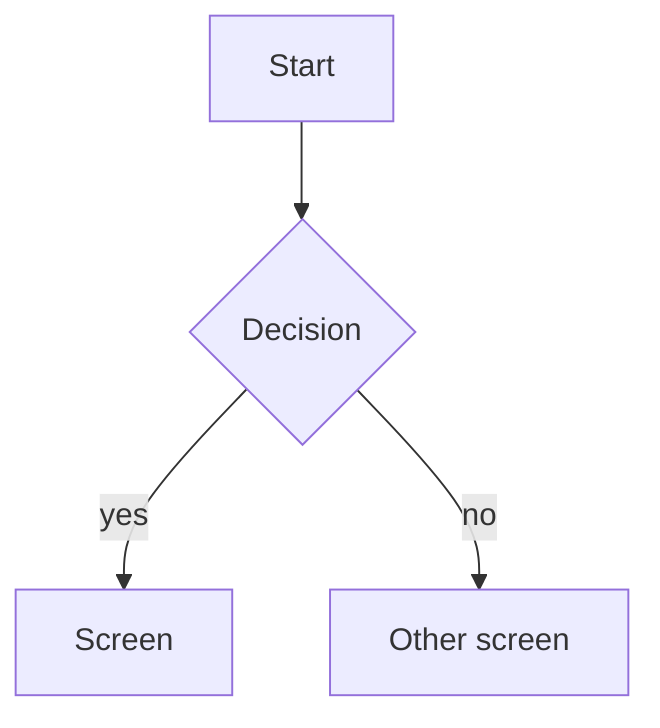

# FLW-<FEATURE>-NN <Flow name>

A use case (ISO/IEC/IEEE 29148, UML 2.5): who does what, in which order, and what happens when it goes wrong.
Exception flows are the best source of negative test cases.

## Actors

## Preconditions

## Postconditions

What is true after the main flow succeeds.

## Diagram

## Main flow

1.

## Alternative flows

| ID  | At step | Condition | What happens | Criteria |
| --- | ------- | --------- | ------------ | -------- |
| A1  |         |           |              |          |

## Exception flows

| ID  | At step | Error | What happens | Criteria |
| --- | ------- | ----- | ------------ | -------- |
| E1  |         |       |              |          |

## Change log

| Date | Change | Why |
| ---- | ------ | --- |
