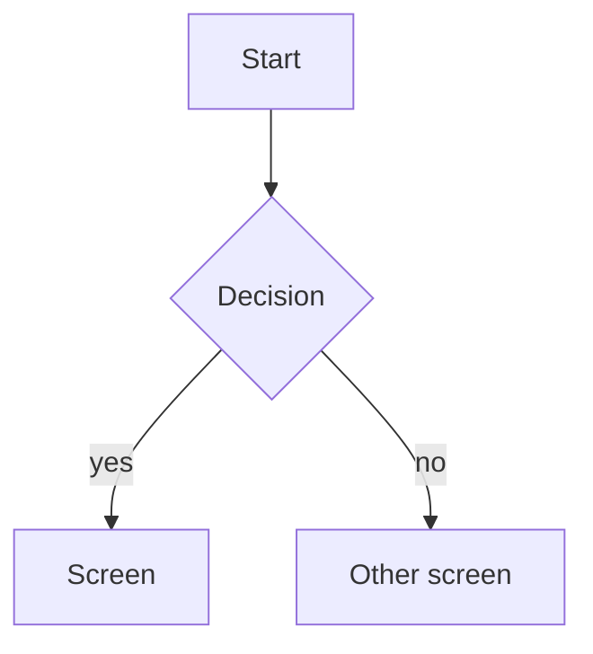

# FLW-<FEATURE>-NN <Flow name>

```mermaid
flowchart TD
    A[Start] --> B{Decision}
    B -- yes --> C[Screen]
    B -- no --> D[Other screen]
```

## Notes

## Change log

| Date | Change | Why |
| ---- | ------ | --- |
