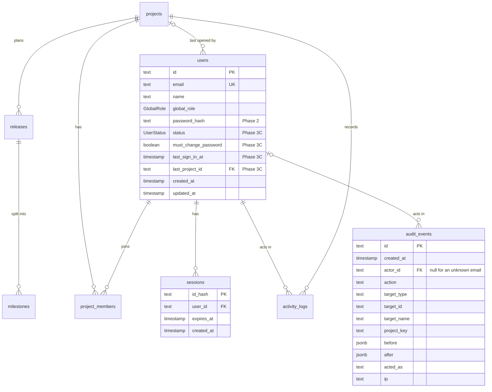

# Database

PostgreSQL 16 in Docker, accessed through Prisma 7 (`apps/api/prisma/schema.prisma`). This page is the overview:
all tables, how they relate, and the shared conventions. Each table has its own file in [tables/](tables/).
The full entity plan for later phases is in
[phases/phase-0-architecture.md §10](../phases/phase-0-architecture.md#10-database-erd-proposal).

## Tables

| Table                                        | Holds                                                    | Prisma model    | Since phase | Status                               |
| -------------------------------------------- | -------------------------------------------------------- | --------------- | ----------- | ------------------------------------ |
| [users](tables/users.md)                     | People who can log in                                    | `User`          | 1           | built (Phase 2 and 3C added columns) |
| [sessions](tables/sessions.md)               | Login sessions (one per browser)                         | `Session`       | 2           | built                                |
| [projects](tables/projects.md)               | Projects                                                 | `Project`       | 3           | designed                             |
| [project_members](tables/project_members.md) | Who is in a project, with which role                     | `ProjectMember` | 3           | designed                             |
| [releases](tables/releases.md)               | Releases of a project                                    | `Release`       | 3           | designed                             |
| [milestones](tables/milestones.md)           | Agile milestones (sprints) inside a release              | `Milestone`     | 3           | designed                             |
| [activity_logs](tables/activity_logs.md)     | Who changed what in a project                            | `ActivityLog`   | 3           | designed                             |
| [audit_events](tables/audit_events.md)       | Sign-ins and admin actions, workspace-wide (Admins only) | `AuditEvent`    | 3 (3C)      | built                                |

## Relationships



| From                    | To            | Type                  | On delete | Meaning                                                      |
| ----------------------- | ------------- | --------------------- | --------- | ------------------------------------------------------------ |
| `sessions.user_id`      | `users.id`    | many to one           | cascade   | A user can be logged in on several browsers                  |
| `users.last_project_id` | `projects.id` | many to one           | set null  | The project the app shell opens on (BR-SHELL-04)             |
| `audit_events.actor_id` | `users.id`    | many to one, optional | restrict  | Who acted; `null` for a failed sign-in with an unknown email |

## Enums

| Enum         | Values                  | Used by                                |
| ------------ | ----------------------- | -------------------------------------- |
| `GlobalRole` | `ADMIN`, `USER`         | `users.global_role`                    |
| `UserStatus` | `ACTIVE`, `DEACTIVATED` | `users.status` (Phase 3C, BR-ADMIN-10) |

## Conventions

- Prisma models are `PascalCase`, tables and columns are `snake_case` (`@@map`, `@map`).
- Primary keys are `cuid` strings; human-readable keys (`BUG-7`) arrive with each entity. Exception: `sessions`
  uses the token hash as its key.
- Timestamps are `timestamp(3)` in UTC.
- Foreign keys are indexed.
- One file per table in [tables/](tables/), copied from [../\_templates/table.md](../_templates/table.md). A table
  file changes in the same PR as its migration.

## Databases

| Name        | Used by                           | Reset how                                                   |
| ----------- | --------------------------------- | ----------------------------------------------------------- |
| `qawm_dev`  | `npm run dev`, Prisma Studio      | `npm run db:reset` (destructive, asks nothing, your call)   |
| `qawm_test` | Playwright runs (`NODE_ENV=test`) | Migrated and seeded automatically before each `npm run e2e` |

Both live in the same Docker container (`qawm-postgres`). `docker/postgres/init/01-create-test-db.sql`
creates `qawm_test` the first time the volume is created.

## Migrations

| Migration                 | Phase  | Changes                                                                                                                      |
| ------------------------- | ------ | ---------------------------------------------------------------------------------------------------------------------------- |
| `init`                    | 1      | Create `users` and `GlobalRole`                                                                                              |
| `add_auth`                | 2      | Add `users.password_hash`, create `sessions`                                                                                 |
| `add_projects`            | 3      | Create `projects`, `project_members`, `releases`, `milestones`, `activity_logs` and their enums                              |
| `admin_console_and_audit` | 3 (3C) | Create `UserStatus`; add `users.status`, `must_change_password`, `last_sign_in_at`, `last_project_id`; create `audit_events` |

```bash
# 1. Edit apps/api/prisma/schema.prisma
# 2. Create + apply a migration to qawm_dev (give it a meaningful name)
npm run db:migrate -- --name add_user_password
# 3. Commit the generated folder in apps/api/prisma/migrations/
# 4. Update the table files in docs/database/tables/ and the tables above
```

- Never edit a migration that has been committed and applied; create a new one.
- `npm run db:migrate` also regenerates the Prisma client (`apps/api/src/generated`, git-ignored).
- Test DB: `npm run db:test:prepare -w @qawm/api` applies migrations and seeds (Playwright runs this for you).

## Seed data

`apps/api/prisma/seed/` is deterministic and idempotent (upserts by unique keys), so it is safe to run repeatedly.
The rows for each table are listed in its table file, for example [users](tables/users.md#seed-data).

## Change log

| Date       | Change                                                                        | Why                                           |
| ---------- | ----------------------------------------------------------------------------- | --------------------------------------------- |
| 2026-10-07 | Split `DATABASE.md` into this overview and one file per table; Phase 2 tables | One file per table, easier to find and review |
| 2026-10-09 | `audit_events`, new `users` columns, `UserStatus`                             | Phase 3C                                      |
