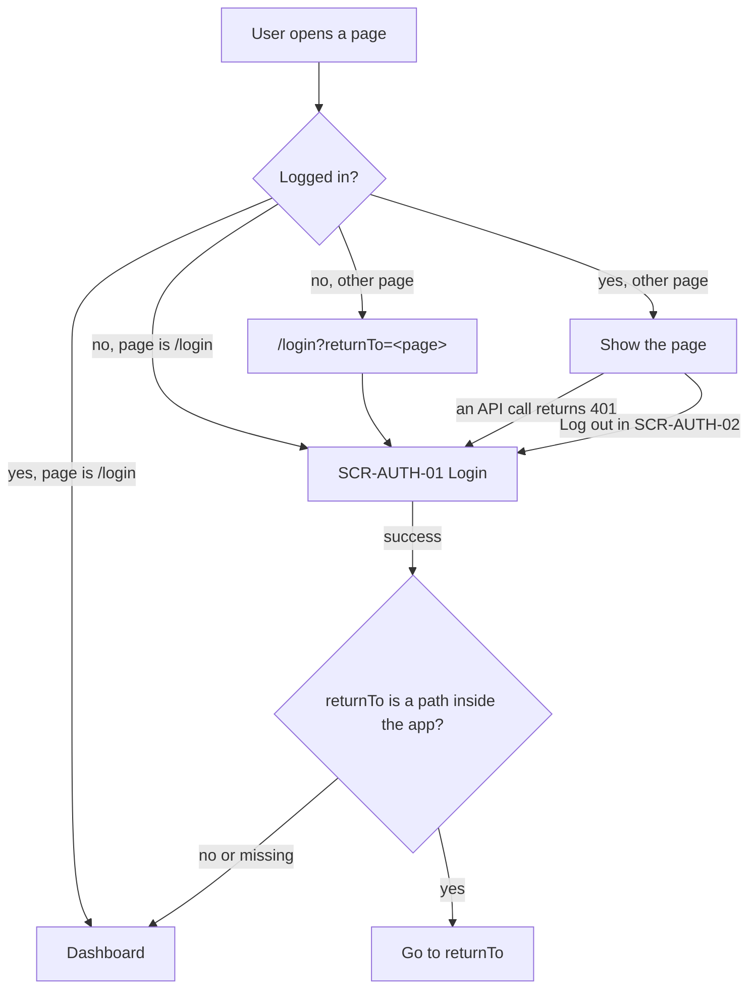

# FLW-AUTH-01 Login, protected pages and redirect

## Notes

- `returnTo` accepts only paths that start with a single `/` (not `//` and not a full URL). Anything else is ignored (BR-AUTH-09).
- A 401 from any API call means the session ended on the server, so the app goes to `/login` (BR-AUTH-11).

## Change log

| Date       | Change        | Why     |
| ---------- | ------------- | ------- |
| 2026-10-07 | First version | Phase 2 |
