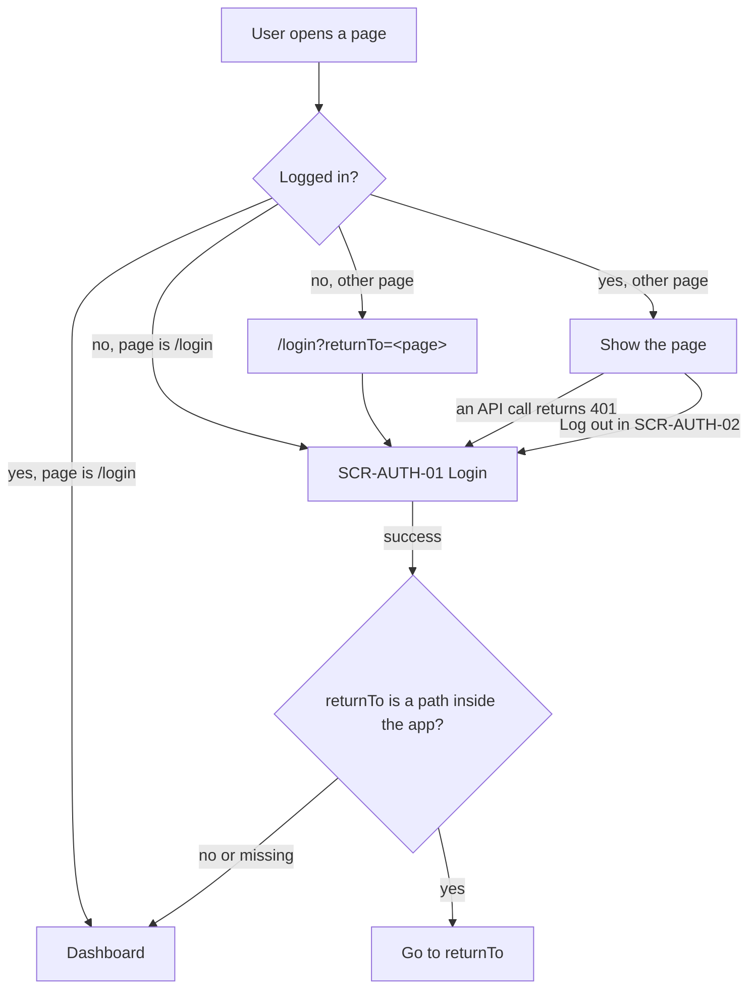

# FLW-AUTH-01 Login, protected pages and redirect

## Actors

Guest (not logged in), User (logged in).

## Preconditions

The user has a seeded account. The API is up.

## Postconditions

The user is logged in and is on the page they asked for, or on the dashboard.

## Diagram

## Main flow

1. A guest opens a protected page, for example `/projects`.
2. The app sends them to `/login?returnTo=%2Fprojects` (BR-AUTH-08).
3. The guest enters a valid email and password and submits ([SCR-AUTH-01](../screens/SCR-AUTH-01-login.md)).
4. The API creates a session and sets the cookie.
5. The app goes to `returnTo`, replacing the history entry (AC-AUTH-22).

## Alternative flows

| ID  | At step | Condition                                   | What happens                              | Criteria   |
| --- | ------- | ------------------------------------------- | ----------------------------------------- | ---------- |
| A1  | 1       | The guest opens `/login` directly           | No `returnTo`; after login, the dashboard | AC-AUTH-23 |
| A2  | 1       | A logged-in user opens `/login`             | Redirected to the dashboard               | AC-AUTH-25 |
| A3  | 1       | A logged-in user opens a protected page     | The page is shown, no login               | AC-AUTH-14 |
| A4  | 5       | `returnTo` is an outside URL or starts `//` | Ignored; the dashboard                    | AC-AUTH-24 |

## Exception flows

| ID  | At step | Error                                  | What happens                                  | Criteria               |
| --- | ------- | -------------------------------------- | --------------------------------------------- | ---------------------- |
| E1  | 3       | Empty or invalid email, empty password | Field messages, no request                    | AC-AUTH-04, AC-AUTH-05 |
| E2  | 4       | Wrong password or unknown email (401)  | MSG-AUTH-01, stay on `/login` with `returnTo` | AC-AUTH-02, AC-AUTH-03 |
| E3  | 4       | Too many failures (429)                | MSG-AUTH-02, stay on `/login`                 | AC-AUTH-11             |
| E4  | later   | An API call returns 401 on a page      | Back to `/login?returnTo=<page>`              | AC-AUTH-26             |

## Notes

- `returnTo` accepts only paths that start with a single `/` (not `//` and not a full URL). Anything else is ignored (BR-AUTH-09).
- A 401 from any API call means the session ended on the server, so the app goes to `/login` (BR-AUTH-11).

## Change log

| Date       | Change                                                                       | Why                                         |
| ---------- | ---------------------------------------------------------------------------- | ------------------------------------------- |
| 2026-10-07 | First version                                                                | Phase 2                                     |
| 2026-10-08 | Use case sections: actors, conditions, main, alternative and exception flows | Documentation standards (docs/STANDARDS.md) |
