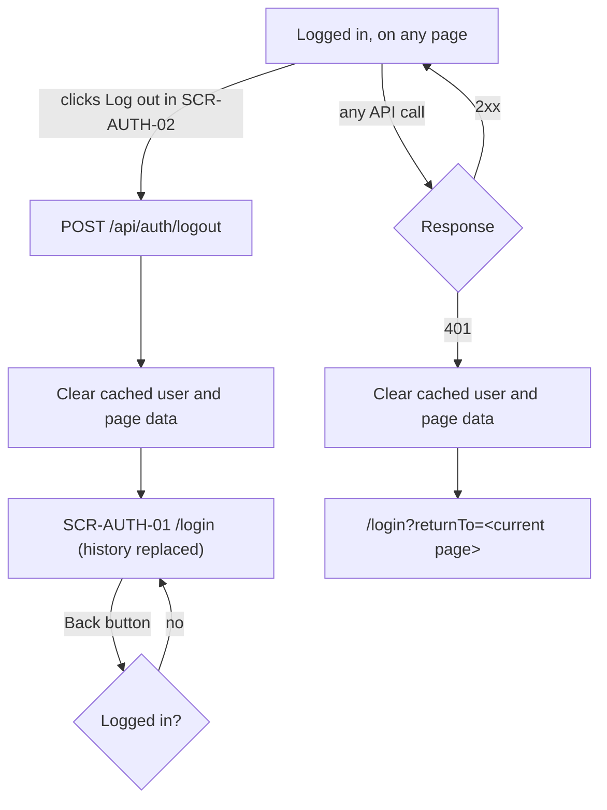

# FLW-AUTH-02 Logout and session end

The two ways a session ends: the user clicks "Log out", or the server no longer accepts the session (it expired
after 7 days, or it was logged out from a copy of the cookie).

## Actors

User (logged in).

## Preconditions

The user is logged in and on any page of the app.

## Postconditions

This browser's session row is deleted, the cookie is cleared, cached page data is gone, and the user is on `/login`.
Sessions in other browsers still work (BR-AUTH-07).

## Diagram

## Main flow

1. The user clicks "Log out" in [SCR-AUTH-02](../screens/SCR-AUTH-02-user-menu.md).
2. The app calls `POST /api/auth/logout`; the API deletes the session and clears the cookie.
3. The app clears cached user and page data.
4. The app shows `/login`, replacing the history entry (AC-AUTH-18).

## Alternative flows

| ID  | At step | Condition                                  | What happens                                    | Criteria               |
| --- | ------- | ------------------------------------------ | ----------------------------------------------- | ---------------------- |
| A1  | 4       | The user presses Back                      | Stays on `/login`; no old page data is shown    | AC-AUTH-19             |
| A2  | 1       | The session expired or was ended elsewhere | The next API call gets 401; `/login?returnTo=…` | AC-AUTH-17, AC-AUTH-26 |

## Exception flows

| ID  | At step | Error                         | What happens                                                          | Criteria   |
| --- | ------- | ----------------------------- | --------------------------------------------------------------------- | ---------- |
| E1  | 2       | Network error on logout       | Steps 3 and 4 still run; the server session may stay until it expires | AC-AUTH-18 |
| E2  | 2       | Someone reuses the old cookie | The API answers 401: the session no longer exists                     | AC-AUTH-20 |

## Notes

- Logout replaces the history entry, and the cached data is cleared, so Back cannot show the old page's data
  (AC-AUTH-19). If the browser restores a page from its cache, the next API call returns 401 and the user lands on
  `/login`.
- After a 401 the user is sent to `/login` with `returnTo`, so they come back to the same page after logging in.
  After a deliberate logout there is no `returnTo`.
- Logging out ends only this browser's session (BR-AUTH-07). Another browser keeps working.

## Change log

| Date       | Change                                                                       | Why                                         |
| ---------- | ---------------------------------------------------------------------------- | ------------------------------------------- |
| 2026-10-07 | First version                                                                | Phase 2                                     |
| 2026-10-08 | Use case sections: actors, conditions, main, alternative and exception flows | Documentation standards (docs/STANDARDS.md) |
