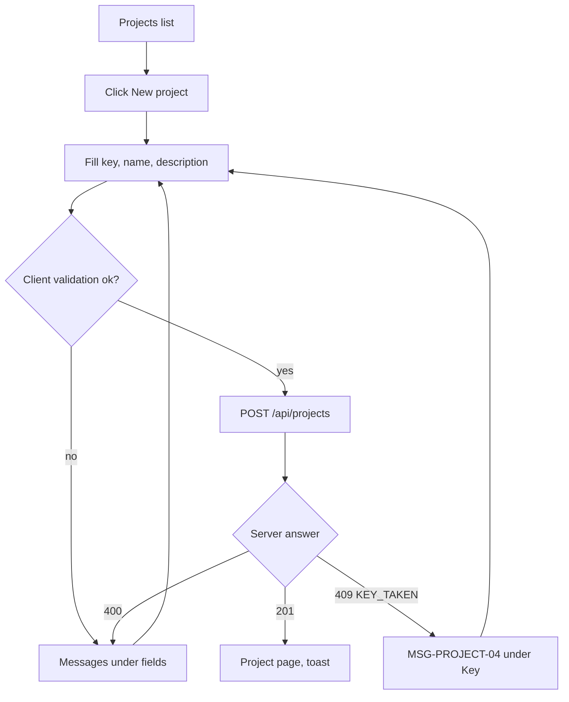

# FLW-PROJECT-01 Create a project

A use case (ISO/IEC/IEEE 29148, UML 2.5): a user creates a project and becomes its Owner.

## Actors

User (any logged-in person). System: web app, API, database.

## Preconditions

The user is logged in and on `/projects` (SCR-PROJECT-01).

## Postconditions

A project exists with the given key and name, the user is its only `OWNER`, one activity entry "created the
project" exists, and the user is on `/projects/<KEY>`.

## Diagram

## Main flow

1. The user clicks "New project"; the dialog opens with focus in Key.
2. The user types key `demo`, name "Demo project", and optionally a description.
3. The web app upper-cases the key as it is typed and checks the fields.
4. The user clicks "Create"; the web app sends `POST /api/projects`.
5. The API validates the body, checks the key is free, and in one transaction creates the project, the Owner
   member row and the activity entry.
6. The API answers 201 with the project; the web app closes the dialog and opens `/projects/DEMO`.

## Alternative flows

| ID  | At step | Condition                                   | What happens                                 | Criteria      |
| --- | ------- | ------------------------------------------- | -------------------------------------------- | ------------- |
| A1  | 2       | The user leaves Description empty           | The project is created without a description | AC-PROJECT-01 |
| A2  | 1       | The user cancels or presses Esc             | Dialog closes, nothing is created            |               |
| A3  | 2       | Name is exactly 3 or exactly 100 characters | Accepted                                     | AC-PROJECT-07 |

## Exception flows

| ID  | At step | Error                                                | What happens                                                | Criteria      |
| --- | ------- | ---------------------------------------------------- | ----------------------------------------------------------- | ------------- |
| E1  | 3       | Key or name empty                                    | MSG-PROJECT-01 / MSG-PROJECT-03 under the field, no request | AC-PROJECT-02 |
| E2  | 3       | Key format wrong (`1AB`, `A`, 11 characters, `AB-1`) | MSG-PROJECT-02                                              | AC-PROJECT-03 |
| E3  | 3       | Name 2 or 101 characters, or only spaces             | MSG-PROJECT-03                                              | AC-PROJECT-06 |
| E4  | 5       | Key already used (any project, archived or hidden)   | 409 `KEY_TAKEN`, MSG-PROJECT-04 under Key                   | AC-PROJECT-05 |
| E5  | 5       | Two people create the same key at the same moment    | The unique index refuses the second: 409 `KEY_TAKEN`        | BR-PROJECT-03 |
| E6  | 4       | Session expired                                      | 401, redirect to login (Phase 2)                            |               |

## Change log

| Date       | Change        | Why      |
| ---------- | ------------- | -------- |
| 2026-10-08 | First version | Phase 3A |
