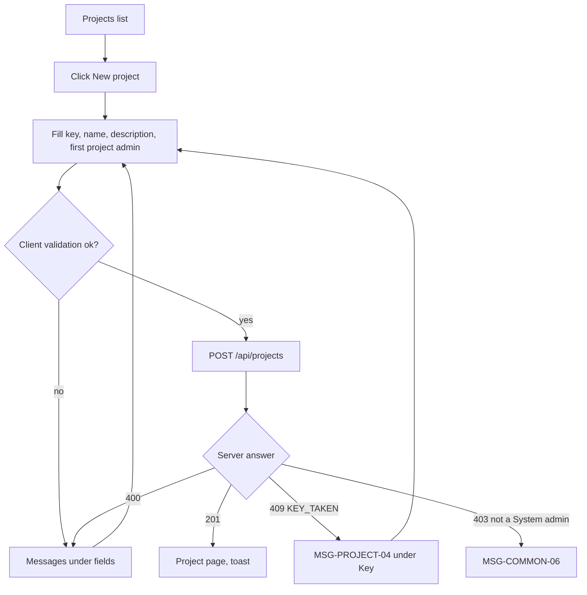

# FLW-PROJECT-01 Create a project

A use case (ISO/IEC/IEEE 29148, UML 2.5): a System admin creates a project and picks its first Project admin
(BR-PROJECT-01).

## Actors

System admin (global role `ADMIN`). First Project admin: the user the System admin picks. System: web app, API,
database.

## Preconditions

The System admin is logged in and on `/projects` (SCR-PROJECT-01). Users who are not System admins see no "New
project" button.

## Postconditions

A project exists with the given key and name; the picked user is its only member, with access `PROJECT_ADMIN` and no
job title; two activity entries exist, "<System admin> created the project" and "<System admin> added <user> as
Project admin"; the System admin is on `/projects/<KEY>` and is not a member (unless they picked themselves).

## Diagram

## Main flow

1. The System admin clicks "New project"; the dialog opens with focus in Key.
2. The System admin types key `demo`, name "Demo project", optionally a description, and picks "Oanh Owner" as First
   project admin.
3. The web app upper-cases the key as it is typed and checks the fields.
4. The System admin clicks "Create"; the web app sends `POST /api/projects` with `firstAdminId`.
5. The API validates the body, checks the caller is a System admin and the first admin is an existing user, checks
   the key is free, and in one transaction creates the project, the Project admin member row and the two activity
   entries.
6. The API answers 201 with the project (`myAccess` `null`); the web app closes the dialog and opens `/projects/DEMO`,
   where the badge shows "System admin".

## Alternative flows

| ID  | At step | Condition                                   | What happens                                                        | Criteria      |
| --- | ------- | ------------------------------------------- | ------------------------------------------------------------------- | ------------- |
| A1  | 2       | Description left empty                      | The project is created without a description                        | AC-PROJECT-01 |
| A2  | 1       | The System admin cancels or presses Esc     | Dialog closes, nothing is created                                   |               |
| A3  | 2       | Name is exactly 3 or exactly 100 characters | Accepted                                                            | AC-PROJECT-07 |
| A4  | 2       | The System admin picks themselves           | They become the Project admin member; `myAccess` is `PROJECT_ADMIN` | BR-PROJECT-01 |

## Exception flows

| ID  | At step | Error                                                   | What happens                                                | Criteria      |
| --- | ------- | ------------------------------------------------------- | ----------------------------------------------------------- | ------------- |
| E1  | 3       | Key or name empty                                       | MSG-PROJECT-01 / MSG-PROJECT-03 under the field, no request | AC-PROJECT-02 |
| E2  | 3       | Key format wrong (`1AB`, `A`, 11 characters, `AB-1`)    | MSG-PROJECT-02                                              | AC-PROJECT-03 |
| E3  | 3       | Name 2 or 101 characters, or only spaces                | MSG-PROJECT-03                                              | AC-PROJECT-06 |
| E4  | 5       | Key already used (any project, archived or hidden)      | 409 `KEY_TAKEN`, MSG-PROJECT-04 under Key                   | AC-PROJECT-05 |
| E5  | 5       | Two people create the same key at the same moment       | The unique index refuses the second: 409 `KEY_TAKEN`        | BR-PROJECT-03 |
| E6  | 4       | Session expired                                         | 401, redirect to login (Phase 2)                            |               |
| E7  | 3, 5    | No first project admin, or `firstAdminId` is not a user | 400, MSG-PROJECT-33 under First project admin               | AC-PROJECT-72 |
| E8  | 5       | The caller is not a System admin (API called directly)  | 403 `FORBIDDEN`, nothing created                            | AC-PROJECT-71 |

## Change log

| Date       | Change                                                                                  | Why                        |
| ---------- | --------------------------------------------------------------------------------------- | -------------------------- |
| 2026-10-08 | First version                                                                           | Phase 3A                   |
| 2026-10-09 | Role model v2: Project admin / Member + job title; only a System admin creates projects | Linh's decision 2026-10-09 |
