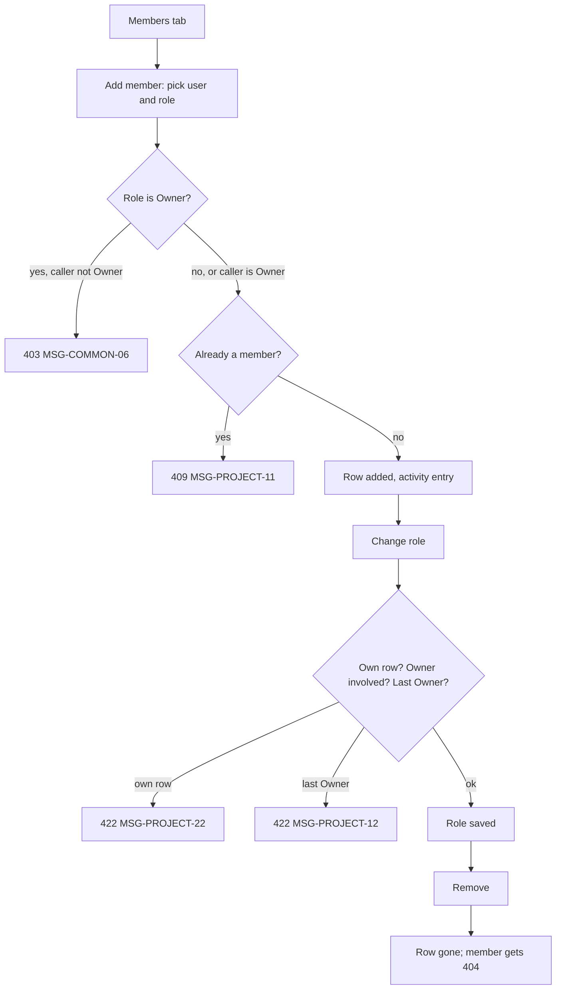

# FLW-PROJECT-02 Manage members

A use case: a manager adds a person, changes their role, then removes them; plus the rules about Owners.

## Actors

Manager: an Owner, Project manager, QA lead or Admin. Member: the person being added. System.

## Preconditions

The manager is logged in, the project is active (not archived), and the manager is on its Members tab
(SCR-PROJECT-03).

## Postconditions

The member list matches what the manager did, the project still has at least one Owner, and each change has one
activity entry.

## Diagram

## Main flow

1. The manager clicks "Add member", searches "Sam", picks Sam Stakeholder and the role Stakeholder, clicks Add.
2. The API checks the manager's permission, that Sam is not a member, and adds the row with an activity entry.
3. The manager changes Sam's role to Viewer in the table; the API saves it with an activity entry.
4. Sam's next request uses the Viewer role, without logging in again.
5. The manager clicks "Remove Sam Stakeholder" and confirms; the API deletes the row with an activity entry.
6. Sam now gets "Project not found" for this project.

## Alternative flows

| ID  | At step | Condition                                                  | What happens                                 | Criteria      |
| --- | ------- | ---------------------------------------------------------- | -------------------------------------------- | ------------- |
| A1  | 1       | The manager is an Owner and picks the role Owner           | Allowed: there are now two Owners            | BR-PROJECT-23 |
| A2  | 3       | An Owner changes their own role while another Owner exists | Allowed (stepping down)                      | AC-PROJECT-51 |
| A3  | 5       | A member clicks "Leave" on their own row                   | Their row is deleted; they go to `/projects` | AC-PROJECT-28 |

## Exception flows

| ID  | At step  | Error                                                                      | What happens                           | Criteria      |
| --- | -------- | -------------------------------------------------------------------------- | -------------------------------------- | ------------- |
| E1  | 2        | The person is already a member                                             | 409 `ALREADY_MEMBER`, MSG-PROJECT-11   | AC-PROJECT-24 |
| E2  | 1–5      | A PM or QA lead adds an Owner, changes an Owner's role or removes an Owner | 403, MSG-COMMON-06                     | AC-PROJECT-49 |
| E3  | 3        | Anyone except a stepping-down Owner changes their own role                 | 422 `OWN_ROLE`, MSG-PROJECT-22         | AC-PROJECT-50 |
| E4  | 3, 5, A3 | The change would leave no Owner                                            | 422 `LAST_OWNER`, MSG-PROJECT-12       | AC-PROJECT-27 |
| E5  | any      | A read-only role calls the member API                                      | 403, MSG-COMMON-06                     | AC-PROJECT-29 |
| E6  | any      | The project is archived                                                    | 422 `PROJECT_ARCHIVED`, MSG-PROJECT-08 | AC-PROJECT-31 |

## Change log

| Date       | Change        | Why      |
| ---------- | ------------- | -------- |
| 2026-10-08 | First version | Phase 3A |
