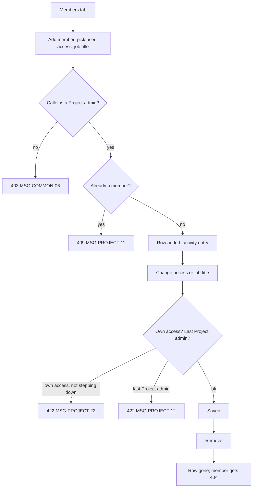

# FLW-PROJECT-02 Manage members

A use case: a Project admin adds a person, changes their access level and job title, then removes them; plus the
rules about the last Project admin and one's own access level.

## Actors

Project admin: a member with access `PROJECT_ADMIN`, or a System admin. Member: the person being added. System.

## Preconditions

The Project admin is logged in, the project is active (not archived), and the Project admin is on its Members tab
(SCR-PROJECT-03).

## Postconditions

The member list matches what the Project admin did, the project still has at least one Project admin, and each
change has one activity entry.

## Diagram

## Main flow

1. The Project admin clicks "Add member", picks Sam Stakeholder, access Member and job title "Stakeholder (STK)",
   clicks Add.
2. The API checks the caller's permission, that Sam is not a member, and adds the row with an activity entry "…
   added Sam Stakeholder as Member (Stakeholder)".
3. The Project admin changes Sam's access to Project admin in the table; the API saves it with an activity entry
   "… changed Sam Stakeholder's access from Member to Project admin".
4. Sam's next request uses the new access level, without logging in again.
5. The Project admin clicks "Remove Sam Stakeholder" and confirms; the API deletes the row with an activity entry.
6. Sam now gets "Project not found" for this project.

## Alternative flows

| ID  | At step | Condition                                                                             | What happens                                                                      | Criteria                     |
| --- | ------- | ------------------------------------------------------------------------------------- | --------------------------------------------------------------------------------- | ---------------------------- |
| A1  | 1       | The Project admin picks the access Project admin                                      | Allowed: there are now more Project admins                                        | AC-PROJECT-75                |
| A2  | 3       | A Project admin changes their own access to Member while another Project admin exists | Allowed (stepping down)                                                           | AC-PROJECT-51                |
| A3  | 5       | A member clicks "Leave" on their own row                                              | Their row is deleted; they go to `/projects`                                      | AC-PROJECT-28                |
| A4  | 3       | The Project admin changes only a job title (anyone's, their own included)             | Saved; the access level is unchanged; entry "… changed …'s job title from … to …" | AC-PROJECT-73, AC-PROJECT-76 |
| A5  | 3       | The body changes nothing                                                              | 200, no activity entry                                                            | BR-PROJECT-19                |

## Exception flows

| ID  | At step  | Error                                                                                      | What happens                             | Criteria      |
| --- | -------- | ------------------------------------------------------------------------------------------ | ---------------------------------------- | ------------- |
| E1  | 2        | The person is already a member                                                             | 409 `ALREADY_MEMBER`, MSG-PROJECT-11     | AC-PROJECT-24 |
| E3  | 3        | The caller sets their own access level, other than a Project admin stepping down to Member | 422 `OWN_ACCESS`, MSG-PROJECT-22         | AC-PROJECT-50 |
| E4  | 3, 5, A3 | The change would leave no Project admin                                                    | 422 `LAST_PROJECT_ADMIN`, MSG-PROJECT-12 | AC-PROJECT-27 |
| E5  | any      | A Member (any job title) calls the member API                                              | 403, MSG-COMMON-06                       | AC-PROJECT-29 |
| E6  | any      | The project is archived                                                                    | 422 `PROJECT_ARCHIVED`, MSG-PROJECT-08   | AC-PROJECT-31 |

E2 (a PM or QA lead touching an Owner) was removed on 2026-10-09: there is no Owner role.

## Change log

| Date       | Change                                                                                  | Why                        |
| ---------- | --------------------------------------------------------------------------------------- | -------------------------- |
| 2026-10-08 | First version                                                                           | Phase 3A                   |
| 2026-10-09 | Role model v2: Project admin / Member + job title; only a System admin creates projects | Linh's decision 2026-10-09 |
