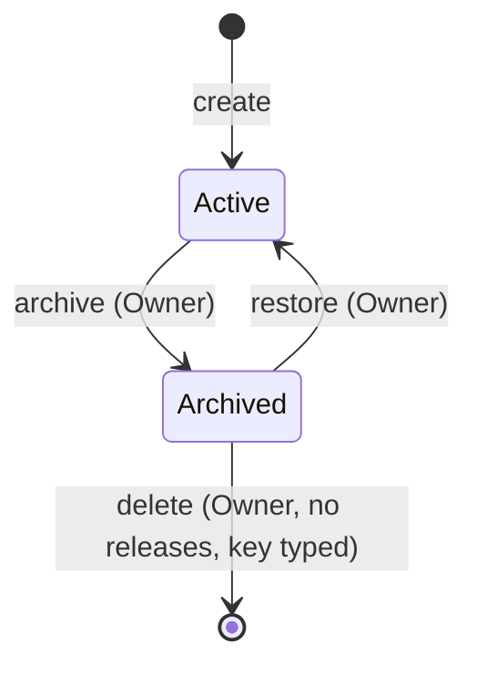

# FLW-PROJECT-03 Archive, restore and delete a project

A use case: an Owner finishes a project, archives it, and later either restores it or deletes it for good.

## Actors

Owner (or Admin). System.

## Preconditions

The Owner is logged in and on the project page (SCR-PROJECT-02).

## Postconditions

Archived: the project is read-only and hidden from the default list. Restored: it is active again, unchanged.
Deleted: the project, its members and its activity are gone, and its key is free to use again.

## Diagram

## Main flow

1. The Owner opens More → Archive and confirms.
2. The API sets `archived_at`, writes an activity entry, and answers 200.
3. The page shows the archived banner; every write button disappears for everyone.
4. Later the Owner clicks Restore; the API clears `archived_at` and writes an entry.

## Alternative flows

| ID  | At step | Condition                                                                                       | What happens                                                                | Criteria      |
| --- | ------- | ----------------------------------------------------------------------------------------------- | --------------------------------------------------------------------------- | ------------- |
| A1  | 4       | The Owner chooses Delete instead of Restore, the project has no releases, and they type the key | `DELETE` succeeds; they land on `/projects`; the page of the key is now 404 | AC-PROJECT-35 |
| A2  | 1       | Someone turns on "Show archived" in the list                                                    | The archived project appears with a badge                                   | AC-PROJECT-12 |

## Exception flows

| ID  | At step  | Error                                                 | What happens                                                        | Criteria      |
| --- | -------- | ----------------------------------------------------- | ------------------------------------------------------------------- | ------------- |
| E1  | 3        | Anyone calls a write endpoint on the archived project | 422 `PROJECT_ARCHIVED`, MSG-PROJECT-08                              | AC-PROJECT-31 |
| E2  | A1       | The project is still active                           | Delete is not offered; API 422 `DELETE_NOT_ALLOWED`, MSG-PROJECT-09 | AC-PROJECT-33 |
| E3  | A1       | The archived project has releases                     | 422 `DELETE_NOT_ALLOWED`, MSG-PROJECT-09                            | AC-PROJECT-34 |
| E4  | A1       | The typed key doesn't match                           | Delete button stays disabled, MSG-PROJECT-10                        | AC-PROJECT-35 |
| E5  | 1, 4, A1 | The caller is not an Owner                            | 403, MSG-COMMON-06                                                  | BR-PROJECT-35 |

## Change log

| Date       | Change        | Why      |
| ---------- | ------------- | -------- |
| 2026-10-08 | First version | Phase 3A |
