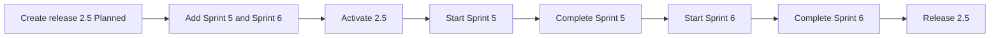

# FLW-PROJECT-04 Plan releases and milestones

A use case: the team plans release 2.5 as two sprints, runs them, and ships the release (agile delivery).

## Actors

Project admin or System admin (releases and milestones), all members (read). System.

## Preconditions

The project is active; release 2.4 is Released (or there is no Active release).

## Postconditions

Release 2.5 is Released; Sprint 5 and Sprint 6 are Completed; every step has an activity entry.

## Diagram

## Main flow

1. A Project admin (Mai PM) creates release 2.5, 2026-11-01 → 2026-11-30 (Planned).
2. She adds Sprint 5 (11-01 → 11-14) and Sprint 6 (11-15 → 11-28), with goals.
3. She activates 2.5.
4. She starts Sprint 5; the project header shows "Current: Sprint 5 · N days left".
5. At the end she completes Sprint 5 and starts Sprint 6, then completes it.
6. She releases 2.5.

## Alternative flows

| ID  | At step | Condition                                           | What happens                                                | Criteria      |
| --- | ------- | --------------------------------------------------- | ----------------------------------------------------------- | ------------- |
| A1  | 1       | No dates are given                                  | The release is created; milestones then have no outer limit | BR-PROJECT-15 |
| A2  | 4       | The sprint's end date passes before it is completed | Header shows "Overdue by N days"; status stays Active       | AC-PROJECT-64 |

## Exception flows

| ID  | At step | Error                                                      | What happens                                    | Criteria                     |
| --- | ------- | ---------------------------------------------------------- | ----------------------------------------------- | ---------------------------- |
| E1  | 2       | Sprint outside 11-01 → 11-30                               | 422 `MILESTONE_OUTSIDE_RELEASE`, MSG-PROJECT-25 | AC-PROJECT-58                |
| E2  | 2       | Sprint 6 starts on 11-14 (shares a day with Sprint 5)      | 422 `MILESTONE_OVERLAP`, MSG-PROJECT-26         | AC-PROJECT-59                |
| E3  | 3       | Another release is still Active                            | 422 `ACTIVE_RELEASE_EXISTS`, MSG-PROJECT-17     | AC-PROJECT-42                |
| E4  | 4       | 2.5 is still Planned, or another sprint is Active          | 422 `CANNOT_ACTIVATE_MILESTONE`, MSG-PROJECT-29 | AC-PROJECT-61, AC-PROJECT-62 |
| E5  | 6       | A sprint of 2.5 is not Completed                           | 422 `OPEN_MILESTONES`, MSG-PROJECT-27           | AC-PROJECT-52                |
| E6  | any     | A Member (any job title, Team lead included) tries a write | 403, MSG-COMMON-06                              | AC-PROJECT-66                |

## Change log

| Date       | Change                                                                                  | Why                        |
| ---------- | --------------------------------------------------------------------------------------- | -------------------------- |
| 2026-10-08 | First version                                                                           | Phase 3A                   |
| 2026-10-09 | Role model v2: Project admin / Member + job title; only a System admin creates projects | Linh's decision 2026-10-09 |
