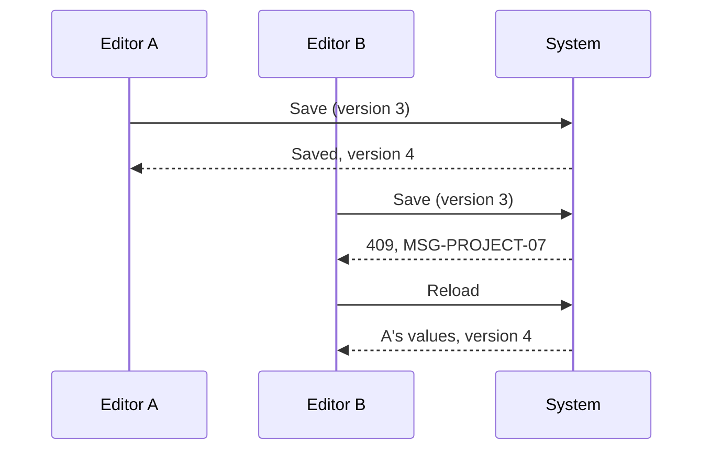

# FLW-PROJECT-05 Two people edit the same project

A use case: two editors open the same project and save one after the other; the second is told instead of
silently overwriting the first.

## Actors

Editor A and Editor B (Owner, Project manager or QA lead, or the same person in two tabs). System.

## Preconditions

Both have the edit dialog of the same project open, loaded at the same `version`.

## Postconditions

A's change is saved; B's change is not; B knows and can reload.

## Diagram

## Main flow

1. A saves; the project is now at version 4.
2. B saves with version 3; the API answers 409 `VERSION_CONFLICT`.
3. B's dialog shows MSG-PROJECT-07 and keeps B's typed values.
4. B clicks "Reload", sees A's values, and redoes the change if still needed.

## Alternative flows

| ID  | At step | Condition                                 | What happens                            | Criteria      |
| --- | ------- | ----------------------------------------- | --------------------------------------- | ------------- |
| A1  | 2       | B saved without changing anything         | 200, nothing saved, no conflict (no-op) | DD-PROJECT-03 |
| A2  | 1       | A archived the project instead of editing | B's save gets 422 `PROJECT_ARCHIVED`    | BR-PROJECT-08 |

## Exception flows

| ID  | At step | Error                                     | What happens             | Criteria      |
| --- | ------- | ----------------------------------------- | ------------------------ | ------------- |
| E1  | 2       | B's request has no `version` (API client) | 400 `VALIDATION_ERROR`   | BR-PROJECT-07 |
| E2  | 4       | The project was deleted meanwhile         | 404, "Project not found" | AC-PROJECT-16 |

## Change log

| Date       | Change        | Why      |
| ---------- | ------------- | -------- |
| 2026-10-08 | First version | Phase 3A |
