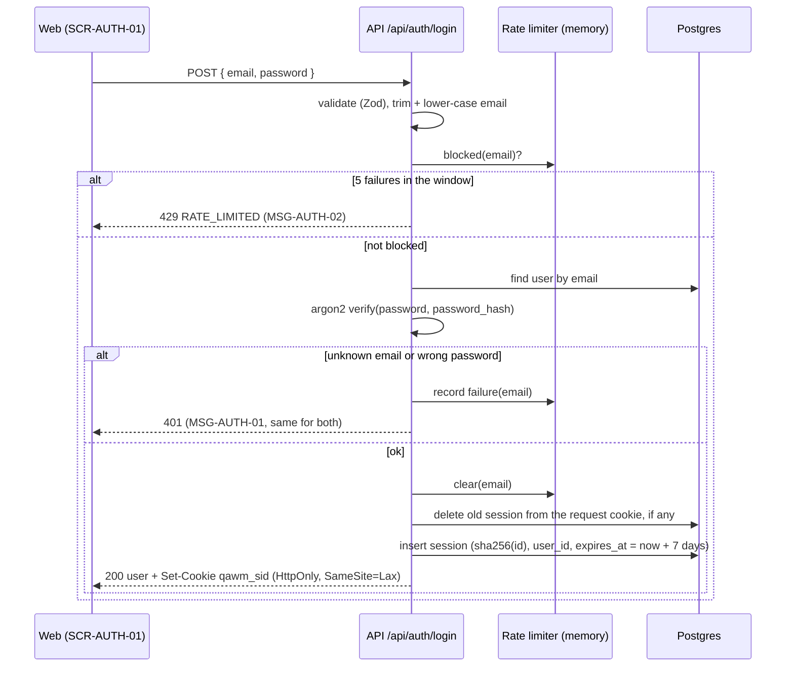

# DD-AUTH-01 Sessions and login rate limit

How login, the session cookie and the rate limit work inside the API. Decisions and reasons are in the
[Phase 2 plan §4](../../../phases/phase-2-plan.md#4-architecture-decisions-for-this-phase).

## Login sequence

## Settings

| Variable                      | Default | Test value | Rule       |
| ----------------------------- | ------- | ---------- | ---------- |
| `SESSION_TTL_HOURS`           | 168     | 168        | BR-AUTH-05 |
| `LOGIN_RATE_LIMIT_MAX`        | 5       | 5          | BR-AUTH-04 |
| `LOGIN_RATE_LIMIT_WINDOW_MIN` | 15      | 15         | BR-AUTH-04 |

All three are validated at startup in `apps/api/src/config/env.ts` (BR-AUTH-13). Tests keep the real limits so
AC-AUTH-10 and AC-AUTH-11 check the real boundary.

Testing note: a blocked email stays blocked for 15 minutes in the running API. The Phase 2 seed adds
`ratelimit@qawm.test` (same password), used **only** by rate-limit tests, so a block never breaks other tests.
Tests with wrong passwords for other cases use a made-up email per test. A local re-run within 15 minutes with a
reused server (`reuseExistingServer`) needs the API restarted.

## Rules in code

| Topic            | Behaviour                                                                                                               | Rule                   |
| ---------------- | ----------------------------------------------------------------------------------------------------------------------- | ---------------------- |
| Session id       | Random id in the cookie; only its SHA-256 hash is stored                                                                | BR-AUTH-06             |
| Expiry           | `expires_at` checked on every request; expired → 401. TTL from `SESSION_TTL_HOURS`                                      | BR-AUTH-05, BR-AUTH-13 |
| Logout           | Deletes only this session row and clears the cookie; other sessions stay                                                | BR-AUTH-06, BR-AUTH-07 |
| Rate limit       | Per lower-cased email, `LOGIN_RATE_LIMIT_MAX` failures in `LOGIN_RATE_LIMIT_WINDOW_MIN` minutes                         | BR-AUTH-04, BR-AUTH-13 |
| Window           | Fixed window: starts at the first failure, the count resets when it ends. 400s and 429s don't count                     | BR-AUTH-04             |
| Reset            | A successful login deletes the email's entry                                                                            | BR-AUTH-14             |
| Unknown email    | Still runs an argon2 verify against a dummy hash, so the response time doesn't reveal which emails exist                | BR-AUTH-03             |
| Memory           | Entries live in a `Map` in the API process; expired entries are removed when read. Restarting the API clears all blocks | BR-AUTH-04             |
| Token            | 32 random bytes (`crypto.randomBytes`), base64url in the cookie only, never in a body or URL                            | BR-AUTH-15             |
| Session fixation | Login deletes the session the request came with, then creates a new one                                                 | BR-AUTH-06             |
| Cleanup          | Expired session rows are deleted on read; a full sweep is not needed in Phase 2                                         | BR-AUTH-05             |
| Password         | Stored as an argon2 hash; never logged or returned                                                                      | BR-AUTH-12             |

## Change log

| Date       | Change                                                                    | Why                       |
| ---------- | ------------------------------------------------------------------------- | ------------------------- |
| 2026-10-07 | First version, from the Phase 2 plan                                      | Phase 2                   |
| 2026-10-07 | Window start, reset on success, settings, token, session fixation, timing | Full login feature design |
