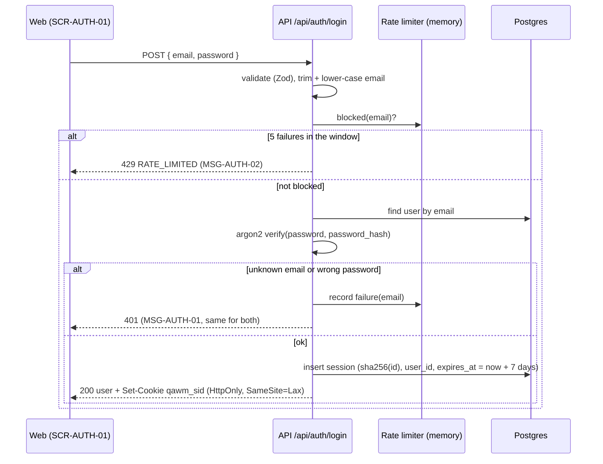

# DD-AUTH-01 Sessions and login rate limit

How login, the session cookie and the rate limit work inside the API. Decisions and reasons are in the
[Phase 2 plan §4](../../../phases/phase-2-plan.md#4-architecture-decisions-for-this-phase).

## Login sequence

## Rules in code

| Topic      | Behaviour                                                                                       | Rule                   |
| ---------- | ----------------------------------------------------------------------------------------------- | ---------------------- |
| Session id | Random id in the cookie; only its SHA-256 hash is stored                                        | BR-AUTH-06             |
| Expiry     | `expires_at` checked on every request; expired → 401. TTL from `SESSION_TTL_HOURS`              | BR-AUTH-05, BR-AUTH-13 |
| Logout     | Deletes only this session row and clears the cookie; other sessions stay                        | BR-AUTH-06, BR-AUTH-07 |
| Rate limit | Per lower-cased email, `LOGIN_RATE_LIMIT_MAX` failures in `LOGIN_RATE_LIMIT_WINDOW_MIN` minutes | BR-AUTH-04, BR-AUTH-13 |
| Password   | Stored as an argon2 hash; never logged or returned                                              | BR-AUTH-12             |

## Change log

| Date       | Change                               | Why     |
| ---------- | ------------------------------------ | ------- |
| 2026-10-07 | First version, from the Phase 2 plan | Phase 2 |
