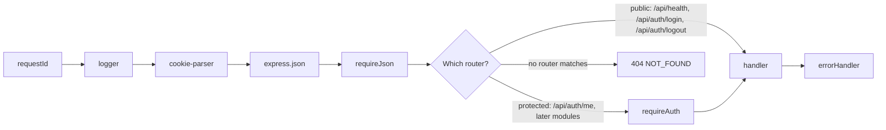

# DD-AUTH-02 API guards (requireAuth, requireJson, cookie)

The Express middleware that protects every API route. Sessions themselves are in
[DD-AUTH-01](DD-AUTH-01-session.md).

## Middleware order



## requireAuth

`apps/api/src/middleware/require-auth.ts`

```mermaid
sequenceDiagram
    participant C as Client
    participant M as requireAuth
    participant DB as Postgres
    C->>M: request + cookie qawm_sid
    alt no cookie
        M-->>C: 401 UNAUTHENTICATED
    else cookie present
        M->>DB: find session by sha256(token), join user
        alt not found, or expires_at <= now
            M->>DB: delete the expired row (if any)
            M-->>C: 401 UNAUTHENTICATED + clear cookie
        else valid
            M->>M: req.user = { id, email, name, globalRole }; req.sessionId = id_hash
            M->>C: next()
        end
    end
```

- One generic 401 for every case, message `Authentication required` (API-AUTH-03).
- `req.user` is typed in `apps/api/src/types/express.d.ts`. Handlers never read the cookie themselves.
- Every protected router starts with `router.use(requireAuth)` (see `authRouter` in
  `apps/api/src/modules/auth/auth.routes.ts`); only `/api/health` and the login and logout routes are public
  (BR-AUTH-08). Unknown paths still return 404 `NOT_FOUND`, as in Phase 1, because no router matches them.

## requireJson (CSRF guard)

`apps/api/src/middleware/require-json.ts`

| Method                   | Rule                                                                         |
| ------------------------ | ---------------------------------------------------------------------------- |
| GET, HEAD, OPTIONS       | No check                                                                     |
| POST, PUT, PATCH, DELETE | `Content-Type` must be `application/json`, else 415 `UNSUPPORTED_MEDIA_TYPE` |

Why: an HTML form on another site can only send `text/plain`, `multipart/form-data` or
`application/x-www-form-urlencoded`. Requiring JSON blocks those cross-site requests, together with
`SameSite=Lax` on the cookie. `UNSUPPORTED_MEDIA_TYPE` is added to `ERROR_CODES` in `packages/shared/src/api.ts`.

## Cookie

| Attribute  | Value                                               | Rule       |
| ---------- | --------------------------------------------------- | ---------- |
| Name       | `qawm_sid`                                          |            |
| Value      | the session token (base64url)                       | BR-AUTH-15 |
| `HttpOnly` | yes: page scripts can't read it                     | BR-AUTH-15 |
| `SameSite` | `Lax`                                               | CSRF       |
| `Secure`   | only when `NODE_ENV=production`                     |            |
| `Path`     | `/`                                                 |            |
| `Max-Age`  | `SESSION_TTL_HOURS` × 3600 (also sent as `Expires`) | BR-AUTH-05 |

The web app and the API share one origin through the Vite proxy (dev) and the Playwright web server (tests), so no
CORS setup is needed.

## Logging

The request logger redacts the `cookie` and `set-cookie` headers and the `password` field (BR-AUTH-12, BR-AUTH-15).

## Change log

| Date       | Change                                                             | Why                            |
| ---------- | ------------------------------------------------------------------ | ------------------------------ |
| 2026-10-07 | First version                                                      | Phase 2                        |
| 2026-10-07 | Protected routers start with `requireAuth`; unknown paths stay 404 | Keep the Phase 1 404 behaviour |
