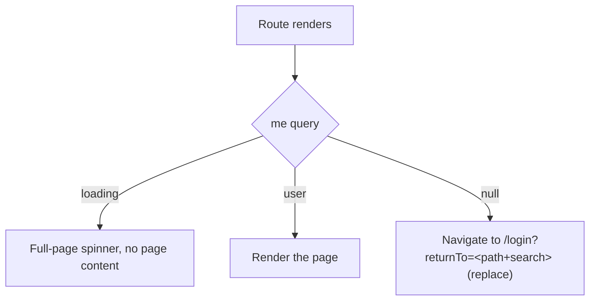

# DD-AUTH-03 Web auth state (login form, RequireAuth, returnTo)

How the React app knows who is logged in and which page to show. Code lives in `apps/web/src/features/auth/`.

## Modules

| File              | Does                                                                                                                                                                     |
| ----------------- | ------------------------------------------------------------------------------------------------------------------------------------------------------------------------ |
| `use-me.ts`       | TanStack Query `['me']` → `GET /api/auth/me`. 401 → `null` (guest), not an error. No retries                                                                             |
| `use-login.ts`    | Mutation → `POST /api/auth/login`; on success clears the cache and sets `['me']` to the returned user                                                                    |
| `use-logout.ts`   | Mutation → `POST /api/auth/logout`; then sets `['me']` to `null`, `navigate('/login', { replace: true })`, removes all other cached data. Runs even if the request fails |
| `RequireAuth.tsx` | Layout route around every page except `/login` (BR-AUTH-08)                                                                                                              |
| `LoginPage.tsx`   | SCR-AUTH-01. Redirects to the dashboard if `me` is a user (BR-AUTH-10)                                                                                                   |
| `UserMenu.tsx`    | SCR-AUTH-02 in `AppLayout`'s header                                                                                                                                      |
| `return-to.ts`    | `safeReturnTo(value)`: the sanitiser below, with unit tests                                                                                                              |

## Routes

```
/login                 LoginPage (no AppLayout user menu)
RequireAuth
  AppLayout
    /                  DashboardPage
    /projects          ProjectsPage
    *                  NotFoundPage
```

## RequireAuth



The page is never rendered before `me` answers, so a guest never sees protected data, even for a moment.
`RequireAuth` also refetches `me` on every route change, so a session that ended on the server is noticed at the
next navigation even on pages that load no data yet (BR-AUTH-11).

## returnTo sanitiser (BR-AUTH-09)

| Input                        | Result              |
| ---------------------------- | ------------------- |
| `/projects`, `/projects?x=1` | kept                |
| missing or empty             | `/`                 |
| `https://evil.com`           | `/`                 |
| `//evil.com`, `/\evil.com`   | `/`                 |
| `/login` or `/login?…`       | `/` (avoids a loop) |
| more than 2048 characters    | `/`                 |

Rule: keep the value only if it starts with exactly one `/` followed by something other than `/` or `\`.

## Global 401 handling (BR-AUTH-11)

`apiFetch` calls an `onUnauthenticated` hook for any 401 except from `/auth/login` and `/auth/me`. The hook clears
the query cache and navigates to `/login?returnTo=<current path>` with `replace`.

## Login form

| Topic         | Behaviour                                                                                                                                                  | Criteria                             |
| ------------- | ---------------------------------------------------------------------------------------------------------------------------------------------------------- | ------------------------------------ |
| Validation    | `loginRequestSchema` from `packages/shared` on submit; field errors under each input (`aria-describedby`), no request sent                                 | AC-AUTH-04, AC-AUTH-05               |
| Submit        | A real `<form onSubmit>`, so Enter submits                                                                                                                 | AC-AUTH-07                           |
| Double submit | Button `disabled` while the mutation is pending                                                                                                            | AC-AUTH-08                           |
| Server error  | Text from MSG-AUTH-01 / MSG-AUTH-02 by error code, in a `role="alert"` element                                                                             | AC-AUTH-02, AC-AUTH-11               |
| Success       | `['me']` now holds the user, so the page renders `<Navigate to={safeReturnTo(returnTo)} replace />`, the same redirect as opening `/login` while logged in | AC-AUTH-01, AC-AUTH-22 to AC-AUTH-24 |
| Autocomplete  | `autocomplete="username"` and `"current-password"`                                                                                                         |                                      |

## Change log

| Date       | Change                                                                              | Why                          |
| ---------- | ----------------------------------------------------------------------------------- | ---------------------------- |
| 2026-10-07 | First version                                                                       | Phase 2                      |
| 2026-10-07 | Login success redirects through the `me` state; logout order; refetch on navigation | Found while building Phase 2 |
