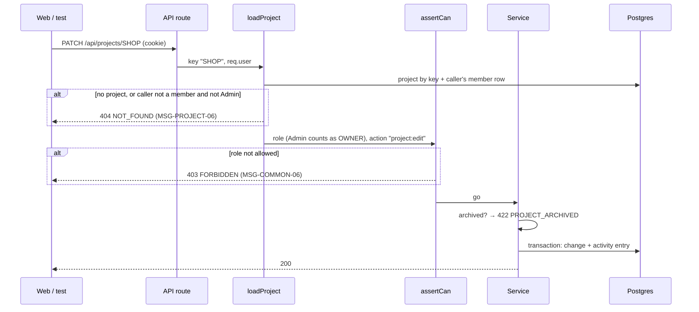

# DD-PROJECT-01 Project access and permissions

How every project-scoped request decides **404, 403 or go**: one loader resolves the project and the caller's role,
one static map says which role may do which action, and the member service adds the rules that depend on the
**target** member (Owner-only, own role, last Owner).

## Sequence

## Rules in code

| Topic                     | Behaviour                                                                                                                                                                                                                                                | Rule                         |
| ------------------------- | -------------------------------------------------------------------------------------------------------------------------------------------------------------------------------------------------------------------------------------------------------- | ---------------------------- |
| Loader                    | `loadProject(key, user)` reads the project and the caller's `project_members` row in one query. Unknown key and "not a member" both throw the same `NotFound` (same body). Admin: role is treated as `OWNER`, member row optional                        | BR-PROJECT-06, BR-PROJECT-36 |
| Key in URL                | Upper-cased before lookup, so `/api/projects/shop` = `SHOP`                                                                                                                                                                                              | BR-PROJECT-02                |
| Permission map            | `PERMISSIONS: Record<Action, ProjectRole[]>` in `apps/api/src/modules/projects/permissions.ts`; actions: `project:view`, `project:edit`, `project:archive`, `project:delete`, `member:manage`, `member:manage-owner`, `release:write`, `milestone:write` | BR-PROJECT-35                |
| `assertCan(role, action)` | Throws `Forbidden` (403) when the role is not listed. The web app gets the same map from `packages/shared` to hide buttons                                                                                                                               | BR-PROJECT-35                |
| Owner-only                | Adding someone as `OWNER`, changing a role from or to `OWNER`, or removing an `OWNER` needs `member:manage-owner` (only `OWNER`)                                                                                                                         | BR-PROJECT-23                |
| Own role                  | `PATCH members/:userId` with `userId = caller` → 422 `OWN_ROLE` (MSG-PROJECT-22), except an `OWNER` changing to another role while another `OWNER` exists                                                                                                | BR-PROJECT-24                |
| Leave                     | `DELETE members/:userId` with `userId = caller` is always allowed by the map (no `member:manage` needed)                                                                                                                                                 | Permission matrix "Leave"    |
| Last Owner                | Inside the transaction, count `OWNER` rows after the change; if 0 → roll back, 422 `LAST_OWNER` (MSG-PROJECT-12)                                                                                                                                         | BR-PROJECT-12                |
| Fresh role                | The role is read from the database on every request, never cached in the session                                                                                                                                                                         | BR-PROJECT-13                |
| Order of checks           | auth (401) → JSON (415) → body schema (400) → loader (404) → permission (403) → archived (422) → business rules (409/422)                                                                                                                                | ADR-0008                     |

Body validation runs before the loader, so a non-member sending a bad body gets 400, not 404. That reveals nothing
about the project because the 400 depends only on the body.

## Errors

| Situation                              | What the code does           | Status / message                 |
| -------------------------------------- | ---------------------------- | -------------------------------- |
| Unknown key, or caller not a member    | `NotFound` from the loader   | 404 `NOT_FOUND`, MSG-PROJECT-06  |
| Member without the action in the map   | `Forbidden` from `assertCan` | 403 `FORBIDDEN`, MSG-COMMON-06   |
| PM/QA lead touches an Owner            | `Forbidden`                  | 403 `FORBIDDEN`, MSG-COMMON-06   |
| Own role change                        | `Unprocessable`              | 422 `OWN_ROLE`, MSG-PROJECT-22   |
| Last Owner removed, demoted or leaving | Transaction rolled back      | 422 `LAST_OWNER`, MSG-PROJECT-12 |

## Security

- OWASP API1 (object level): every project-scoped route goes through `loadProject`; no route reads a project by
  key or id any other way. A lint rule bans `prisma.project.findUnique` outside the loader.
- OWASP API5 (function level): every write route calls `assertCan` with a named action; a unit test fails if a
  route file has a write handler without it.
- 404 bodies for "unknown" and "not a member" are identical, including `type` and `detail` (NFR-PROJECT-01).
- The member list returns `id`, `name`, `email`, `role` only, never `password_hash` or sessions.

## Testability

- `SHOP` has one seed user per role, so a test can loop over 8 logins for the same action.
- `SECRET` has only Ada Admin, so Linh QA gets 404 on it; Admin isn't a member of `SHOP`, for AC-PROJECT-67.
- Unit test: the full matrix (8 roles × 8 actions) against `PERMISSIONS`, written as a table so it reads like the
  README matrix.
- The last-Owner race (two Owners demote each other at once) can only be reached reliably in a unit test with two
  transactions.

## Change log

| Date       | Change        | Why      |
| ---------- | ------------- | -------- |
| 2026-10-08 | First version | Phase 3A |
