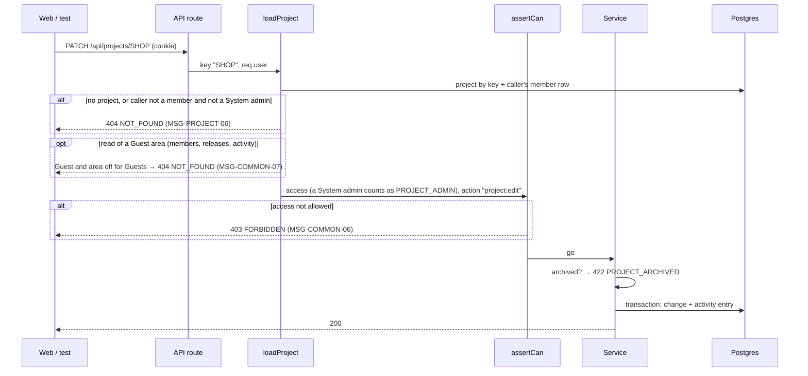

# DD-PROJECT-01 Project access and permissions

How every project-scoped request decides **404, 403 or go**: one loader resolves the project and the caller's access
level, one static map says which access level may do which action, and the member service adds the rules that
depend on the **target** member (own access level, last Project admin). Job titles play no part
([ADR-0011](../../../decisions/ADR-0011-project-access-levels-and-job-titles.md)).

## Sequence

## Rules in code

| Topic                       | Behaviour                                                                                                                                                                                                                                                                                                                                                                                                                                                                                     | Rule                         |
| --------------------------- | --------------------------------------------------------------------------------------------------------------------------------------------------------------------------------------------------------------------------------------------------------------------------------------------------------------------------------------------------------------------------------------------------------------------------------------------------------------------------------------------- | ---------------------------- |
| Create                      | `createProject` has no project to load: it refuses with 403 unless `user.globalRole` is `ADMIN`, then checks `firstAdminId` is an existing, active user (400 at `/firstAdminId`, MSG-PROJECT-33) and inserts that user as `PROJECT_ADMIN`; `guest_areas` is copied from `workspace_settings.default_guest_areas`                                                                                                                                                                              | BR-PROJECT-01, BR-GUEST-02   |
| Loader                      | `loadProject(key, user)` reads the project and the caller's `project_members` row in one query. Unknown key and "not a member" both throw the same `NotFound` (same body). System admin: `access` is treated as `PROJECT_ADMIN`, member row optional; `myAccess` is their own row's access or `null`                                                                                                                                                                                          | BR-PROJECT-06, BR-PROJECT-36 |
| Key in URL                  | Upper-cased before lookup, so `/api/projects/shop` = `SHOP`                                                                                                                                                                                                                                                                                                                                                                                                                                   | BR-PROJECT-02                |
| Permission map              | `PERMISSIONS: Record<Action, ProjectAccess[]>` in `packages/shared/src/permissions.ts`; actions: `project:view`, `project:edit`, `project:guests`, `release:write`, `milestone:write`, `member:manage`, `project:archive`, `project:delete`. Every write is `PROJECT_ADMIN` only; `GUEST` has `project:view` only                                                                                                                                                                             | BR-PROJECT-35                |
| Guest areas                 | `assertArea(ctx, area)` (loader.ts) right after `loadProject` on every read of an area: throws `NotFound` (404, MSG-COMMON-07) when the caller's access is `GUEST` and `project.guest_areas` does not hold the area; everyone else passes. Areas so far: `members` (API-PROJECT-08), `releases` (API-RELEASE-01, API-MILESTONE-01, and the release and sprint groups of search), `activity` (API-PROJECT-12). `canSeeArea` in `packages/shared/src/guest.ts` is the same test for the web app | BR-GUEST-03                  |
| Guest member list           | `listMembers` for a Guest leaves out other `GUEST` rows (keeps the caller) and sets `email` to `null` except the caller's own                                                                                                                                                                                                                                                                                                                                                                 | BR-GUEST-05                  |
| `assertCan(access, action)` | Throws `Forbidden` (403) when the access level is not listed. The web app gets the same map from `packages/shared` to hide buttons                                                                                                                                                                                                                                                                                                                                                            | BR-PROJECT-35                |
| Job title                   | Never read by the permission check                                                                                                                                                                                                                                                                                                                                                                                                                                                            | BR-PROJECT-37                |
| Managing Project admins     | No extra rule: `member:manage` covers adding, changing and removing Project admins                                                                                                                                                                                                                                                                                                                                                                                                            | BR-PROJECT-23                |
| Own access level            | `PATCH members/:userId` with `userId = caller` and a changed `access` → 422 `OWN_ACCESS` (MSG-PROJECT-22), except a `PROJECT_ADMIN` changing to `MEMBER`. A change of only `jobTitle` is allowed                                                                                                                                                                                                                                                                                              | BR-PROJECT-24                |
| Leave                       | `DELETE members/:userId` with `userId = caller` is always allowed by the map (no `member:manage` needed)                                                                                                                                                                                                                                                                                                                                                                                      | Permission matrix "Leave"    |
| Last Project admin          | Inside the transaction, count `PROJECT_ADMIN` rows after the change; if 0 → roll back, 422 `LAST_PROJECT_ADMIN` (MSG-PROJECT-12)                                                                                                                                                                                                                                                                                                                                                              | BR-PROJECT-12                |
| Fresh access                | The access level is read from the database on every request, never cached in the session                                                                                                                                                                                                                                                                                                                                                                                                      | BR-PROJECT-13                |
| Order of checks             | auth (401) → JSON (415) → body schema (400) → loader (404) → permission (403) → archived (422) → business rules (409/422). Create: body schema (400) → System admin (403) → first admin exists (400) → key free (409)                                                                                                                                                                                                                                                                         | ADR-0008                     |

Body validation runs before the loader, so a non-member sending a bad body gets 400, not 404. That reveals nothing
about the project because the 400 depends only on the body.

## Errors

| Situation                                      | What the code does                   | Status / message                         |
| ---------------------------------------------- | ------------------------------------ | ---------------------------------------- |
| Unknown key, or caller not a member            | `NotFound` from the loader           | 404 `NOT_FOUND`, MSG-PROJECT-06          |
| Member without the action in the map           | `Forbidden` from `assertCan`         | 403 `FORBIDDEN`, MSG-COMMON-06           |
| Guest reads an area switched off               | `NotFound` from `assertArea`         | 404 `NOT_FOUND`, MSG-COMMON-07           |
| Not a System admin creates a project           | `Forbidden` in `createProject`       | 403 `FORBIDDEN`, MSG-COMMON-06           |
| First project admin unknown or deactivated     | `ValidationError` at `/firstAdminId` | 400 `VALIDATION_ERROR`, MSG-PROJECT-33   |
| Own access level change                        | `Unprocessable`                      | 422 `OWN_ACCESS`, MSG-PROJECT-22         |
| Last Project admin removed, demoted or leaving | Transaction rolled back              | 422 `LAST_PROJECT_ADMIN`, MSG-PROJECT-12 |

## Security

- OWASP API1 (object level): every project-scoped route goes through `loadProject`; no route reads a project by
  key or id any other way. A lint rule bans `prisma.project.findUnique` outside the loader.
- OWASP API5 (function level): every write function in the `*.service.ts` files calls `assertCan` with a named
  action, except `createProject`, which checks the global role `ADMIN` instead; a unit test (`guards.test.ts`) fails
  if one doesn't.
- 404 bodies for "unknown" and "not a member" are identical, including `type` and `detail` (NFR-PROJECT-01).
- The member list returns `userId`, `name`, `email`, `access`, `jobTitle`, `addedAt` only, never `password_hash` or
  sessions.

## Testability

- `SHOP` has two Project admins, five Members and one Guest (Sam Stakeholder) with different job titles; Ada Admin
  (System admin) is a member of no seed project, so the four columns of the matrix can each be tested with one login.
- `SECRET` has only Oanh Owner, so Linh QA gets 404 on it; Ada Admin isn't a member of `SHOP`, for AC-PROJECT-67.
- Unit test (`permissions.test.ts`): the full matrix (3 access levels × 8 actions) against `PERMISSIONS`, written
  as a table so it reads like the README matrix. `npm run docs:check` also compares the README matrix with the map.
- The last-Project-admin race (two Project admins step down at once) can only be reached reliably in a unit test with
  two transactions.

## Change log

| Date       | Change                                                                                      | Why                                       |
| ---------- | ------------------------------------------------------------------------------------------- | ----------------------------------------- |
| 2026-10-08 | First version                                                                               | Phase 3A                                  |
| 2026-10-09 | The guard test checks service write functions, not route handlers                           | Matches the code                          |
| 2026-10-09 | Role model v2: Project admin / Member + job title; only a System admin creates projects     | Linh's decision 2026-10-09                |
| 2026-10-09 | Guest: `assertArea`, Guest member list, `project:guests` action, active first Project admin | Guest access (BR-GUEST-01 to BR-GUEST-05) |
