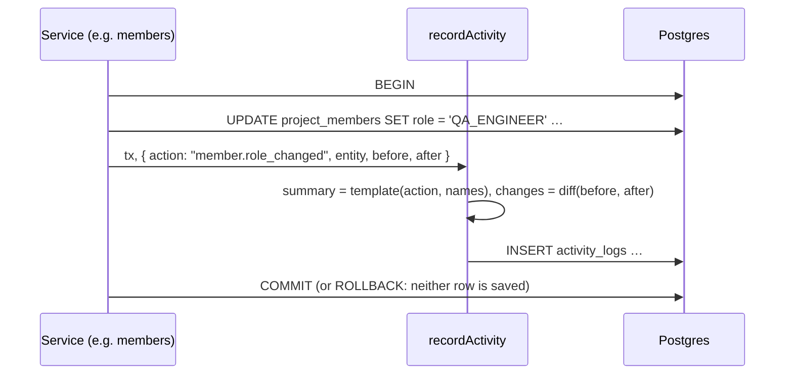

# DD-PROJECT-02 Activity log

What is written for each change, how it is written atomically, and how it is read page by page.

## Sequence

## Actions and summaries

| `action`                                                        | Summary template                                    | `changes`             |
| --------------------------------------------------------------- | --------------------------------------------------- | --------------------- |
| `project.created`                                               | {actor} created the project                         | `null`                |
| `project.updated`                                               | {actor} edited the project                          | `name`, `description` |
| `project.archived` / `project.restored`                         | {actor} archived / restored the project             | `null`                |
| `member.added`                                                  | {actor} added {member} as {role}                    | `null`                |
| `member.role_changed`                                           | {actor} changed {member}'s role from {old} to {new} | `role`                |
| `member.removed` / `member.left`                                | {actor} removed {member} / {actor} left the project | `null`                |
| `release.created` / `release.updated` / `release.deleted`       | {actor} created / edited / deleted release {name}   | edited fields         |
| `release.status_changed`                                        | {actor} moved release {name} from {old} to {new}    | `status`              |
| `milestone.created` / `milestone.updated` / `milestone.deleted` | {actor} created / edited / deleted milestone {name} | edited fields         |
| `milestone.status_changed`                                      | {actor} moved milestone {name} from {old} to {new}  | `status`              |

Role and status names in summaries are the display names ("QA Engineer", "Active"). Project deletion writes no
entry: the log is deleted with the project.

## Rules in code

| Topic          | Behaviour                                                                                                                             | Rule                          |
| -------------- | ------------------------------------------------------------------------------------------------------------------------------------- | ----------------------------- |
| One helper     | Services call `recordActivity(tx, input)` with the transaction client; it has no way to run outside a transaction                     | BR-PROJECT-22                 |
| Summary frozen | The sentence is built at write time, so renaming a user later does not change old entries                                             | BR-PROJECT-20                 |
| Diff           | `diff(before, after)` keeps only fields whose value changed; an edit that changes nothing writes no entry and does not bump `version` | BR-PROJECT-20                 |
| Append-only    | No update or delete code path; the API has only `GET` for activity                                                                    | BR-PROJECT-21                 |
| Page           | `GET …/activity?limit=20&cursor=<id>`: `ORDER BY created_at DESC, id DESC`, rows after the cursor row; `limit` 1–100                  | BR-PROJECT-21, NFR-PROJECT-05 |
| Next cursor    | `meta.nextCursor` is the last row's id, or `null` when there are no more                                                              | BR-PROJECT-21                 |

## Errors

| Situation                     | What the code does                                    | Status / message                    |
| ----------------------------- | ----------------------------------------------------- | ----------------------------------- |
| Insert of the entry fails     | Whole transaction rolls back; the change is not saved | 500 `INTERNAL_ERROR`, MSG-COMMON-02 |
| Cursor id not in this project | Treated as invalid                                    | 400 `VALIDATION_ERROR`              |
| `limit` outside 1–100         | Schema rejects it                                     | 400 `VALIDATION_ERROR`              |

## Security

Only members (and Admins) can read a project's log (loader in DD-PROJECT-01). Entries contain names, not emails
or ids of other projects. No endpoint can change or delete an entry (AC-PROJECT-46).

## Testability

- Each API test that changes data can read `GET …/activity?limit=1` and assert the newest `action` and `summary`.
- AC-PROJECT-45 needs 25 entries: create a project via the API and make 24 small edits in a loop.
- AC-PROJECT-47: send a refused request (403, 409, 422), then check the entry count did not change.
- The rollback when the insert fails is reachable only in a unit test (inject a failing `recordActivity`).

## Change log

| Date       | Change        | Why      |
| ---------- | ------------- | -------- |
| 2026-10-08 | First version | Phase 3A |
