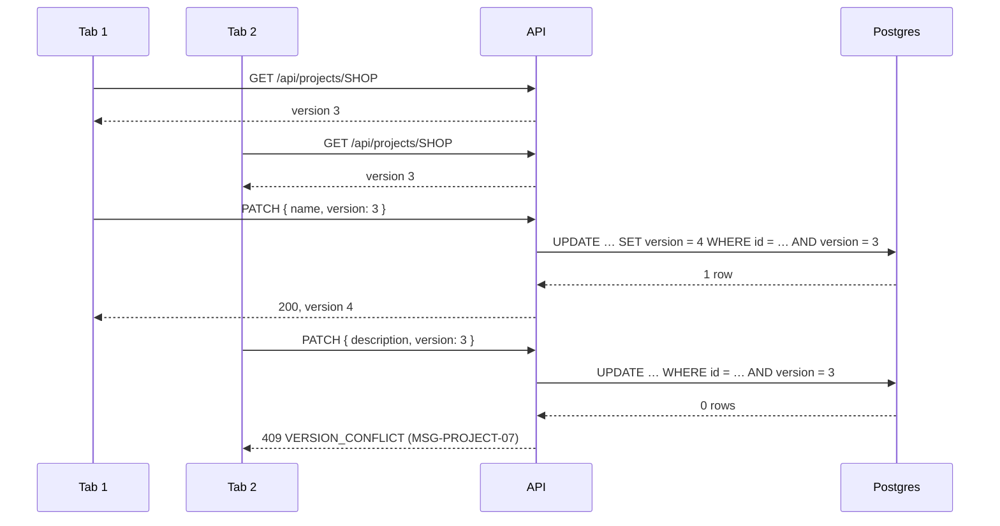

# DD-PROJECT-03 Optimistic locking

How two people editing the same project (or release, or milestone) at the same time are detected. Decision:
[ADR-0009](../../../decisions/ADR-0009-optimistic-locking.md).

## Sequence

## Rules in code

| Topic            | Behaviour                                                                                                                                                         | Rule                         |
| ---------------- | ----------------------------------------------------------------------------------------------------------------------------------------------------------------- | ---------------------------- |
| Version sent     | Every `PATCH` body for a project, release or milestone requires `version` (integer ≥ 1); missing → 400                                                            | BR-PROJECT-07                |
| One statement    | `updateWithVersion(model, id, version, data)` runs `updateMany({ where: { id, version }, data: { …data, version: { increment: 1 } } })`; `count = 0` → `Conflict` | BR-PROJECT-07                |
| Status change    | Status changes go through the same helper, so a stale status change is also a conflict                                                                            | BR-PROJECT-16, BR-PROJECT-31 |
| Archive, restore | Need no `version` (one-click actions); they still bump it, so an open edit form becomes stale                                                                     | BR-PROJECT-08                |
| No-op edit       | Nothing changed → 200 with the current row, `version` unchanged, no activity entry                                                                                | DD-PROJECT-02                |
| Web              | On 409 the form stays open with the user's input, shows MSG-PROJECT-07 in an alert and a "Reload" button that refetches                                           | AC-PROJECT-21                |

## Errors

| Situation                           | What the code does               | Status / message                       |
| ----------------------------------- | -------------------------------- | -------------------------------------- |
| Stale `version`                     | Nothing saved, no activity entry | 409 `VERSION_CONFLICT`, MSG-PROJECT-07 |
| `version` missing or not an integer | Schema rejects it                | 400 `VALIDATION_ERROR`                 |
| Record deleted meanwhile            | Loader finds nothing             | 404 `NOT_FOUND`                        |

## Security

The version is not a secret and gives no access; permission checks run before it (DD-PROJECT-01). The client
can't set `version` to a value of its choice: the server always increments.

## Testability

- UI: two pages in one browser context (`context.newPage()` twice), edit and save in both: the second shows
  MSG-PROJECT-07.
- API: read once, `PATCH` twice with the same `version`: 200 then 409.
- The response of every `GET` and `PATCH` includes `version`, so tests never guess it.

## Change log

| Date       | Change        | Why      |
| ---------- | ------------- | -------- |
| 2026-10-08 | First version | Phase 3A |
