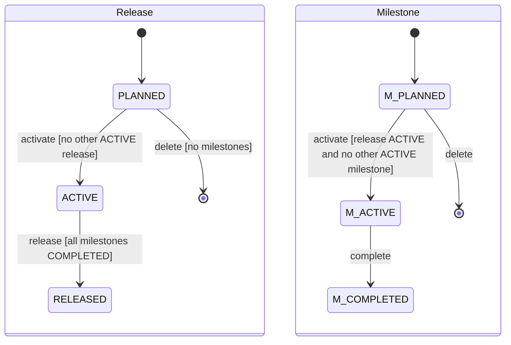

# DD-PROJECT-04 Release and milestone lifecycle

The states of a release and a milestone, the guards on each transition, and the date checks for milestones.

## Sequence

```mermaid
sequenceDiagram
    participant W as Web
    participant A as API
    participant DB as Postgres
    W->>A: PATCH /api/projects/SHOP/milestones/:id { status: ACTIVE, version }
    A->>DB: BEGIN; SELECT release, other ACTIVE milestone FOR UPDATE
    alt release not ACTIVE or another milestone ACTIVE
        A-->>W: 422 CANNOT_ACTIVATE_MILESTONE (MSG-PROJECT-29)
    end
    A->>DB: UPDATE status, version + 1; INSERT activity
    A-->>W: 200
```

## State



(`M_` prefixes only keep the two diagrams apart; the stored values are `PLANNED`, `ACTIVE`, `COMPLETED`.)
Skipping a state (`PLANNED → RELEASED`) is not allowed either: each move is one step forward.

## Rules in code

| Topic                 | Behaviour                                                                                                                                                              | Rule                         |
| --------------------- | ---------------------------------------------------------------------------------------------------------------------------------------------------------------------- | ---------------------------- |
| Transition table      | `RELEASE_NEXT = { PLANNED: 'ACTIVE', ACTIVE: 'RELEASED' }`, `MILESTONE_NEXT = { PLANNED: 'ACTIVE', ACTIVE: 'COMPLETED' }`; any other target → 409 `INVALID_TRANSITION` | BR-PROJECT-16, BR-PROJECT-31 |
| One active            | Checked in the service, and a partial unique index catches a race                                                                                                      | BR-PROJECT-17, BR-PROJECT-32 |
| Release → RELEASED    | Refused while any milestone of the release is not `COMPLETED`                                                                                                          | BR-PROJECT-25                |
| New milestone         | Refused with 422 `RELEASE_CLOSED` (MSG-PROJECT-32) when the release is `RELEASED`                                                                                      | BR-PROJECT-25                |
| Milestone length      | `days = end − start + 1`; must be 1 to `MILESTONE_MAX_DAYS` (default 28)                                                                                               | BR-PROJECT-28                |
| Inside release        | If the release has `start_date`, milestone `start ≥ release.start`; if it has `target_date`, milestone `end ≤ release.target`                                          | BR-PROJECT-29                |
| No overlap            | Two milestones of one release overlap when `a.start ≤ b.end AND b.start ≤ a.end` (inclusive days, so sharing one day overlaps)                                         | BR-PROJECT-30                |
| Editing release dates | Refused with 422 `MILESTONE_OUTSIDE_RELEASE` if an existing milestone would fall outside the new dates                                                                 | BR-PROJECT-29                |
| Days left             | Web computes from today (UTC date): `end − today` for Active; negative → "Overdue by N days"; never changes status                                                     | BR-PROJECT-34                |
| Names                 | Trimmed; `name_normalized = lower(name)`; unique per project                                                                                                           | BR-PROJECT-14, BR-PROJECT-27 |

## Errors

| Situation                                       | What the code does | Status / message                                                                    |
| ----------------------------------------------- | ------------------ | ----------------------------------------------------------------------------------- |
| Backwards or skipping status                    | Nothing saved      | 409 `INVALID_TRANSITION`, MSG-PROJECT-16 (release) / MSG-PROJECT-28 (milestone)     |
| Second active release                           | Nothing saved      | 422 `ACTIVE_RELEASE_EXISTS`, MSG-PROJECT-17                                         |
| Release with open milestones                    | Nothing saved      | 422 `OPEN_MILESTONES`, MSG-PROJECT-27                                               |
| Milestone can't be activated                    | Nothing saved      | 422 `CANNOT_ACTIVATE_MILESTONE`, MSG-PROJECT-29                                     |
| Milestone too long, too short, end before start | Schema rejects it  | 400 `VALIDATION_ERROR`, MSG-PROJECT-24                                              |
| Milestone outside its release                   | Nothing saved      | 422 `MILESTONE_OUTSIDE_RELEASE`, MSG-PROJECT-25                                     |
| Overlap                                         | Nothing saved      | 422 `MILESTONE_OVERLAP`, MSG-PROJECT-26                                             |
| Target before start (release)                   | Schema rejects it  | 400 `VALIDATION_ERROR`, MSG-PROJECT-15                                              |
| Duplicate name                                  | Nothing saved      | 409 `RELEASE_NAME_TAKEN` (MSG-PROJECT-14) / `MILESTONE_NAME_TAKEN` (MSG-PROJECT-30) |
| Delete not allowed                              | Nothing deleted    | 422 `DELETE_NOT_ALLOWED`, MSG-PROJECT-18 / MSG-PROJECT-31                           |

## Security

Write actions need `release:write` or `milestone:write` (DD-PROJECT-01). `project_id` of a milestone is always
copied from its release, never read from the body, so a milestone can't be attached to another project's release:
a `releaseId` from another project gives 404.

## Testability

- Dates in tests are built from `new Date()` so they never expire; the seed's sprint dates are relative to the seed
  day for the same reason.
- `MILESTONE_MAX_DAYS` is a setting, so a test server can lower it if needed.
- The partial unique index (race of two activations) is reachable only in a unit test with two transactions.
- Boundary set for AC-PROJECT-56/57: 1, 28 and 29 days; for AC-PROJECT-58: one day before the release start and
  one day after its target; for AC-PROJECT-59: sharing exactly one day.

## Change log

| Date       | Change                                             | Why                              |
| ---------- | -------------------------------------------------- | -------------------------------- |
| 2026-10-08 | First version                                      | Phase 3A                         |
| 2026-10-09 | Added the `RELEASE_CLOSED` rule for new milestones | Gap found while building the API |
