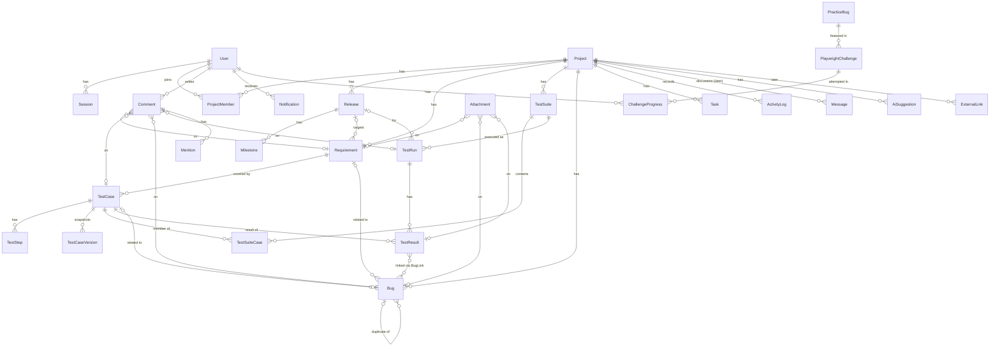

# QA Work Management — Phase 0: Product Architecture

Status: **Approved with answers (2026-10-07, see section 18)** · Date: 2026-10-07 · Author: Claude (senior engineer / QA architect / Playwright mentor)

No application code is written in this phase. Everything below is a proposal; decisions marked **[Decision]** are my recommended defaults and can be overruled before Phase 1. Open questions are collected at the end of section 17.

---

## 0. Repository inspection

| Checked                               | Result                                                                        |
| ------------------------------------- | ----------------------------------------------------------------------------- |
| Repository attached to this project   | None. No GitHub account is linked yet, so there is no remote repo to inspect. |
| Shared project files                  | Empty (this document is the first file).                                      |
| Folders on your Mac visible to Claude | Only `Documents/English Speaking`, which is unrelated.                        |

**Conclusion:** this is a greenfield project. There is no existing code, schema, or convention to stay compatible with, so the choices below are made from first principles. Before Phase 1 we need to decide where the code lives (see Q1 in section 17).

---

## 1. Product vision

**One sentence:** QA Work Management is a QA workspace where AI is a reviewer-in-the-loop at every stage from requirement to regression, and where the product itself doubles as a realistic Playwright training ground.

### What makes it different from "Jira + test tool + chatbot"

1. **The QA lifecycle is the spine, not tickets.** The core chain is Requirement → Test Case → Test Run → Result → Bug → Regression. Every entity is linked to its neighbours so traceability and coverage are queries, not spreadsheets.
2. **AI acts on context, not on a blank prompt.** Each AI action is a button attached to a specific object (a requirement, a run, a bug) and is fed real, scoped project data. The chat is the last AI surface we build, not the first.
3. **AI never writes directly to QA data.** Every AI output is a _suggestion_ stored separately, reviewed by a human, and only then turned into real records. Provenance (AI Generated / AI Suggested / Human Approved) is visible forever.
4. **AI separates FACT from INFERENCE.** Every AI claim carries evidence references (IDs of records it used) or is explicitly labelled as inference with a stated confidence. "Not enough data" is a valid answer.
5. **The product is a Playwright gym.** Accessible, semantic UI makes it a good locator-practice target; a deterministic REST API makes it a good APIRequestContext target; an isolated Practice Sandbox contains deliberate bugs to hunt; and the Playwright Lab coaches you with graded hints and AI code review.
6. **Integration-ready, not integration-heavy.** Jira, GitHub, Slack, CSV and friends attach later through a connector layer and outbound domain events. Nothing in the core assumes they exist.

### Non-goals (for now)

- Replacing Jira for developers (no sprint boards, story points, or dev workflow).
- Running arbitrary user code on our server (see section 17, risk R3).
- Multi-tenant SaaS billing, SSO, enterprise permissions.

---

## 2. MVP definition

The MVP is the smallest product a QA engineer could use for one real release, with AI genuinely helping, and that already supports Playwright practice.

### In the MVP (Phases 1–10)

| Area          | Included                                                                                                                                                                                           |
| ------------- | -------------------------------------------------------------------------------------------------------------------------------------------------------------------------------------------------- |
| Foundation    | Monorepo, React/Vite web app, Express API, PostgreSQL + Prisma, seed data, lint/typecheck, Playwright set up                                                                                       |
| Auth          | Email + password, httpOnly session cookie, logout, project-level roles                                                                                                                             |
| Projects      | CRUD, archive, members + roles, releases, milestones (simple date + name), project activity                                                                                                        |
| Requirements  | CRUD, priority/status/assignee/tags/release, comments, attachments                                                                                                                                 |
| Test cases    | CRUD, ordered steps, duplicate, search/filter/sort, archive, version history, link to requirement                                                                                                  |
| Test suites   | Static suites (Smoke, Regression, …) with ordered test cases                                                                                                                                       |
| Test runs     | Create run from suite (release, environment, browser, tester), record results (Passed/Failed/Blocked/Skipped/Not Run), actual result, screenshot upload, link/create bug                           |
| Bugs          | Full field set, workflow with enforced transitions, comments, attachments, links to requirement/test case/result                                                                                   |
| Collaboration | Comments with @mentions, activity log, in-app notifications (polling)                                                                                                                              |
| Dashboard     | Real metrics computed from the database; rule-based risk indicators with explanations (no AI yet)                                                                                                  |
| AI            | AI service layer + provider abstraction + Mock provider; AI QA Workspace action panel; **Requirement Analyzer**; **Test Case Generator** with the full Generate → Review → Edit → Approve workflow |
| Playwright    | A real E2E + API test suite in the repo that you build phase by phase, with an exercise after every phase                                                                                          |

### After the MVP (Phases 11–19)

Bug Assistant, Test Run Analyzer, Coverage and Risk Analyzers, AI QA Chat, Playwright Lab UI (challenges, hint levels), API Testing Workspace UI, Practice Bugs, Playwright Coach, AI code review, Playwright test generator, Reports/export, Integrations, Deployment.

### Explicitly deferred

Team chat (`Message` table exists but no UI in MVP), real-time push (we poll first), full-text/semantic search (we start with `ILIKE` + trigram), Tasks (minimal table only; see Q6), email notifications.

**Why this cut:** it delivers the full manual QA loop end-to-end plus the two AI capabilities with the highest value-to-risk ratio (they read one requirement and write suggestions, so mistakes are cheap and reviewable). The heavier analyzers need real historical data to be honest, and they only have that once runs and bugs exist.

---

## 3. User personas

| Persona                               | Who                           | Primary goals                                                             | What they need from us                                                               |
| ------------------------------------- | ----------------------------- | ------------------------------------------------------------------------- | ------------------------------------------------------------------------------------ |
| **Linh, QA Engineer (primary)**       | Manual QA learning automation | Design good tests fast, run them, report clear bugs, grow into automation | AI that drafts scenarios she can judge; a place to practice Playwright on a real app |
| **Minh, QA Lead**                     | Owns quality for a release    | Know what is tested, what is at risk, where to focus                      | Coverage, run progress, risk summary with reasons, team workload                     |
| **Dev, Developer**                    | Fixes bugs                    | Reproduce quickly, know when to hand back for retest                      | Precise bug reports with steps/env/evidence; clear status workflow                   |
| **Pat, Product Owner / Viewer**       | Owns requirements             | Know whether a release is ready                                           | Read-only dashboard and release readiness, ambiguity flags on their requirements     |
| **Learner** (Linh in "learning mode") | Practicing Playwright         | Progress through graded challenges without spoilers                       | Challenges, staged hints, code review that explains _why_                            |
| **Admin**                             | Runs the instance             | Users, settings, AI provider config                                       | Simple admin screens and environment variables                                       |

---

## 4. Main user workflows

### W1. Requirement → tests (AI-assisted)

1. QA creates requirement "Password Reset" in release 2.4.
2. Clicks **[Analyze Requirement]** → AI returns scenarios grouped by category (happy, negative, boundary, validation, permission, security, error handling, integration), each with _why it matters_, plus **missing information** and **ambiguities** as questions for the PO.
3. QA posts ambiguity questions as a comment mentioning the PO.
4. Clicks **[Generate Test Cases]** → AI drafts test cases into a **review queue** (status `DRAFT`, badge "AI Generated").
5. QA edits, rejects, or approves each draft. Approved ones become real test cases (badge "AI Generated · Human Approved").

### W2. Execute a release regression

1. QA Lead builds "Regression 2.4" suite.
2. Creates a run: release 2.4, env Staging, browser Chrome, tester Linh.
3. Linh executes results one by one; for a failure she enters actual result + screenshot and clicks **[Create Bug]**, which pre-fills the bug from the test case steps and result.
4. Run completes; dashboard updates pass rate, blocked count, open critical bugs.

### W3. Bug lifecycle

OPEN → IN_PROGRESS → FIXED → RETEST → CLOSED, with REOPENED from RETEST/CLOSED, and REJECTED/DUPLICATE as terminal states from OPEN or IN_PROGRESS. Each transition is validated server-side, logged, and notifies the assignee/reporter. A RETEST bug suggests which test cases to re-run.

### W4. Release readiness

QA Lead opens the project dashboard for 2.4 → sees execution progress, failing areas, open bugs by severity, requirements without tests → (later) **[QA Risk Analysis]** explains High/Medium/Low areas with the evidence behind each.

### W5. Learn Playwright on the feature you just built

After each phase: concept explanation → small exercise against the new feature → you write the test → I review → you improve. Later, the same loop happens in-product via Playwright Lab.

### W6. Hunt a practice bug

Open a challenge "Pagination skips an item" → explore the Practice Sandbox → reproduce → write a failing Playwright test → file a bug in the real app → link the test to it → the challenge checks the link and marks it solved.

---

## 5. Feature map

```
QA Work Management
├── Workspace
│   ├── Dashboard (global + per project/release)
│   ├── Notifications
│   └── Search (global, later)
├── Project
│   ├── Overview & Activity
│   ├── Members & Roles
│   ├── Releases & Milestones
│   ├── Requirements ── [Analyze] [Generate Tests] [Coverage Gaps]
│   ├── Test Cases ──── [Improve] [Review Quality] [Generate Playwright Test]
│   ├── Test Suites
│   ├── Test Runs ───── [Analyze Failures] [Analyze Risk] [Suggest Next Tests]
│   ├── Bugs ────────── [Improve Report] [Find Similar] [Suggest Regression]
│   ├── Tasks (minimal)
│   └── Reports
├── AI QA Workspace
│   ├── Suggestions inbox (everything pending review)
│   ├── Project actions [Risk] [Coverage] [Regression Recommendation]
│   └── QA Chat (project-scoped, evidence-cited)
├── Playwright Lab
│   ├── Levels 1–6 challenges
│   ├── Hint ladder (1 → 4 → Solution)
│   ├── Code Review
│   └── Progress
├── Practice Sandbox (isolated, deliberately buggy)
├── API Testing Workspace (endpoint explorer, examples, auth helper)
├── Integrations (connector registry, later)
└── Admin (users, AI provider settings)
```

Phase mapping is in section 15.

---

## 6. System architecture

```
┌────────────────────────── Browser ──────────────────────────┐
│ React + Vite SPA (TanStack Query, React Router, shadcn/ui)  │
└───────────────▲───────────────────────────────┬─────────────┘
                │ JSON over HTTPS, session cookie │
┌───────────────┴───────────────────────────────▼─────────────┐
│ Express API (TypeScript)                                     │
│  middleware: requestId → logger → session → auth → validate  │
│  modules: auth, projects, requirements, test-cases, suites,  │
│           runs, bugs, comments, notifications, dashboard,    │
│           ai, lab, practice, integrations                    │
│  ┌──────────────┐  ┌──────────────┐  ┌─────────────────────┐ │
│  │ Domain       │  │ AI Service   │  │ Integration layer   │ │
│  │ services     │─▶│ capabilities │  │ (connectors, later) │ │
│  └──────┬───────┘  └──────┬───────┘  └─────────▲───────────┘ │
│         │ domain events (in-process bus) ───────┘             │
└─────────┼─────────────────┼──────────────────────────────────┘
          ▼                 ▼
   PostgreSQL (Prisma)   AI Provider adapter → Anthropic / OpenAI / Mock
          │
   File storage adapter → local disk (dev) / S3-compatible (later)
```

**[Decision] Modular monolith.** One API process, organised by feature module with strict boundaries. Microservices would add deployment and debugging cost with no benefit at this scale, and a monolith is far easier to learn and test.

**[Decision] Monorepo** with three apps/packages plus the test project (section 16). Shared Zod schemas give the frontend and backend one source of truth for validation and types.

Cross-cutting concerns:

- **Validation:** Zod at the API boundary (body, params, query) using schemas from `packages/shared`.
- **Errors:** typed `AppError` subclasses → one error middleware → consistent JSON.
- **Logging:** `pino` with a `requestId` on every line; the requestId is returned in the error body so a failing Playwright test can be matched to a server log line.
- **Config:** `.env` parsed and validated with Zod at startup; the app refuses to start with bad config.
- **Domain events:** services emit `bug.created`, `testRun.completed`, etc. on an in-process bus. Activity log, notifications, and (later) integrations subscribe. This is what makes integrations a plug-in rather than a rewrite.

---

## 7. Frontend architecture

| Concern      | Choice                                          | Why                                                                               |
| ------------ | ----------------------------------------------- | --------------------------------------------------------------------------------- |
| Build        | Vite + React 19 + TypeScript strict             | Fast, standard                                                                    |
| Routing      | React Router (data routers)                     | URLs per entity make deep-linking and Playwright `page.goto` easy                 |
| Server state | TanStack Query                                  | Caching, loading/error states, invalidation; no hand-rolled fetch logic           |
| Forms        | react-hook-form + Zod resolver (shared schemas) | Same validation messages as the API                                               |
| UI           | Tailwind + shadcn/ui (Radix primitives)         | Radix is accessible by default, which is exactly what makes `getByRole` work well |
| Client state | React state/context only                        | No Redux; nothing needs it                                                        |
| API client   | One typed `apiClient` wrapper over `fetch`      | Single place for credentials, error parsing, requestId                            |

### Structure (feature-first)

```
apps/web/src/
  app/            router, providers, layout shell, error boundary
  features/
    projects/     api.ts (query hooks) · components/ · pages/ · schemas re-exported
    requirements/
    test-cases/
    ...
    ai/           AiActionPanel, SuggestionReview, ProvenanceBadge
  components/ui/  shadcn primitives (generated)
  components/     shared composites: DataTable, EmptyState, ConfirmDialog, PageHeader
  lib/            apiClient, formatters, queryClient
```

### Testability and accessibility rules (enforced in code review)

1. Every interactive element has an accessible name: real `<button>`, `<a>`, `<label htmlFor>`; icon-only buttons get `aria-label`.
2. Every page has one `<h1>`; landmark regions (`<nav>`, `<main>`, `<aside>`).
3. Tables are real `<table>` with `<th scope>` so you can practice `getByRole('row').filter({ hasText })`.
4. Loading states use `aria-busy` and a visible "Loading…" text; empty states have a heading; errors use `role="alert"`. This gives web-first assertions something meaningful to wait on.
5. Toasts use `role="status"`.
6. `data-testid` only where no semantic handle exists (e.g. chart canvases, drag handles). Each use gets a one-line comment explaining why.
7. No CSS-generated IDs or class names as test hooks.

---

## 8. Backend architecture

### Layering per module

```
apps/api/src/modules/bugs/
  bugs.routes.ts       Express router: paths + middleware (auth, validate) only
  bugs.controller.ts   HTTP ↔ service translation; no business rules
  bugs.service.ts      business rules, transactions, permission checks, events
  bugs.workflow.ts     status transition table (pure, unit-tested)
  bugs.schemas.ts      re-exports/extends shared Zod schemas
  bugs.test.ts         Vitest unit tests for service/workflow
```

**[Decision] No repository layer.** Prisma already is a typed data-access layer; wrapping it again is the "unnecessary abstraction" you asked to avoid. Services call Prisma directly; complex reads go in a `bugs.queries.ts` file if they grow.

### Authentication and authorization

**[Decision] Server-side sessions in an httpOnly cookie**, not JWTs in localStorage.

- Password hashing with `argon2` (or `bcrypt` if native builds are a problem on your Mac).
- `Session` table: random 256-bit id (stored hashed), userId, expiresAt. Cookie: `httpOnly; SameSite=Lax; Secure` in production.
- Logout deletes the session row, so logout is real (a JWT cannot be revoked without extra machinery).
- CSRF: SameSite=Lax plus requiring `Content-Type: application/json` on mutating requests.
- Login rate limiting (`express-rate-limit`) and generic error messages ("Invalid email or password").
- **Why this is great for Playwright:** you will learn `storageState` (save a logged-in cookie once, reuse it), and API tests can log in with `request.post('/api/auth/login')` and reuse the same cookie jar. Later we add **personal API tokens** (`Authorization: Bearer`) so you can also practice header-based auth.

**Roles**

- Global: `ADMIN`, `USER`.
- Per project (`ProjectMember.role`): `OWNER`, `QA_LEAD`, `QA_ENGINEER`, `DEVELOPER`, `VIEWER`.
- Permissions are a static map `role → allowed actions` checked in services (`assertCan(user, 'bug:transition', project)`), not scattered `if` statements. A permission matrix table will live in `ARCHITECTURE.md` and doubles as a test matrix for permission cases.

### Other backend rules

- Every write that changes QA data runs in a Prisma transaction that also writes the `ActivityLog` row, so the log can't drift from the data.
- Human-readable IDs (`TC-12`, `BUG-7`, `REQ-3`) are per-project sequences allocated inside the transaction with a row lock on the project counter (concurrency case worth testing).
- Optimistic concurrency on edits: entities carry `version`; `PUT` must send the version it read; mismatch → `409 CONFLICT`. Two-tab editing is a great Playwright multi-page exercise.
- Soft archive (`archivedAt`) for projects, requirements, test cases; hard delete only where the spec says Delete and nothing references the row.

---

## 9. AI architecture

### Layers

```
Frontend: AiActionButton → POST /api/ai/requirements/:id/analyze
   │  (no prompts, no provider keys, no free-form model calls from the browser)
Backend route → AiController → capability (e.g. RequirementAnalyzer)
   capability:
     1. load context      ContextBuilder pulls scoped DB data, enforces token budget
     2. build prompt      versioned template (prompts/requirement-analyzer.v1.ts)
     3. call provider     AiProvider.generateStructured({ schema, messages, ... })
     4. validate output   Zod schema; one repair retry; else AiOutputError
     5. ground output     check every cited ID exists in the context that was sent
     6. persist           AiSuggestion row (status PENDING_REVIEW)
   │
AiProvider interface ← AnthropicProvider | OpenAIProvider | MockProvider
```

### Provider abstraction

```ts
// conceptual, not final code
interface AiProvider {
  name: string;
  generateStructured<T>(req: {
    system: string;
    messages: AiMessage[];
    schema: ZodType<T>; // converted to JSON schema / tool definition per provider
    maxOutputTokens: number;
    temperature?: number;
  }): Promise<{ data: T; usage: TokenUsage; model: string }>;
}
```

- Selected by env: `AI_PROVIDER=anthropic|openai|mock`, `AI_MODEL=...`, `AI_API_KEY=...`.
- **[Decision] Default provider: Anthropic Claude** (model set via `AI_MODEL`), with the **Mock provider as the default in dev and test**. The Mock returns deterministic fixtures per capability, so the app runs with no API key and Playwright tests are never flaky or costly because of a live model.
- Structured output uses the provider's tool/JSON-schema mode; we never regex free text.

### Capability contract

Each capability is a module with the same shape:

| Part          | Example (RequirementAnalyzer)                                                                                                                |
| ------------- | -------------------------------------------------------------------------------------------------------------------------------------------- |
| Input         | `{ requirementId }` (IDs only; the server loads the data)                                                                                    |
| Context       | the requirement, its release, existing linked test cases (titles only), project glossary                                                     |
| Output schema | `scenarios[] { category, title, whyItMatters, priority, kind: FACT/INFERENCE }`, `missingInformation[]`, `ambiguities[] { quote, question }` |
| Validation    | Zod; max 25 scenarios; categories from an enum; no empty `whyItMatters`                                                                      |
| Errors        | `AI_PROVIDER_UNAVAILABLE` (503), `AI_OUTPUT_INVALID` (502), `AI_CONTEXT_TOO_LARGE` (422), `AI_RATE_LIMITED` (429)                            |
| Persistence   | `AiSuggestion` (type `REQUIREMENT_ANALYSIS`)                                                                                                 |

Capabilities: `RequirementAnalyzer`, `TestCaseGenerator`, `CoverageAnalyzer`, `BugAssistant`, `TestRunAnalyzer`, `RiskAnalyzer`, `PlaywrightCoach`, `PlaywrightCodeReviewer`, `PlaywrightTestGenerator`, plus `QaChat` later.

### Trust model (AI Suggestion → Human Review → Approve → Save)

- `AiSuggestion` holds raw output, provider, model, prompt version, input entity refs, token usage, status `PENDING_REVIEW | ACCEPTED | PARTIALLY_ACCEPTED | REJECTED`, reviewer, reviewedAt.
- Accepting creates real rows through the normal domain services (same validation, same permissions, same activity log), with `origin = AI_GENERATED` and `aiSuggestionId` set.
- Test cases from AI land with `status = DRAFT` and need an explicit **Approve** action by a user with QA rights → `status = APPROVED`, `approvedById`, `approvedAt`. There is no code path that sets APPROVED without a human request.
- UI badges: **AI Generated** (origin AI, not yet approved), **AI Suggested** (inline suggestion not yet applied, e.g. severity), **Human Approved** (approved by a named user).
- AI never edits an existing record in place. "Improve bug report" produces a diff the user applies or discards.

### Honesty rules (built into prompts _and_ checked in code)

- Every insight has `evidence: [{ entityType, entityId }]` or `kind: "INFERENCE"` with `confidence: low|medium|high` and `basis` text.
- Grounding check: evidence IDs not present in the sent context are stripped and the insight is downgraded to INFERENCE.
- If the context lacks data (e.g. no test runs yet), capabilities return an explicit `insufficientData` reason instead of guesses. The Risk Analyzer explains factors (bug counts, severities, failure history, coverage) rather than inventing numeric scores.

### Context management

- Context builders select by relevance (same requirement, same release, same tags) and truncate by an approximate token budget, recording what was dropped so the UI can say "based on the 40 most recent bugs".
- No cross-project data in any context.

### Cost and safety

- Per-user and per-project AI rate limits; `AiUsage` totals per day.
- Prompt-injection hygiene: user content is placed in clearly delimited data blocks; the model has no tools that write data; output is schema-validated.
- API keys only on the server.

---

## 10. Database ERD proposal

PostgreSQL + Prisma, migrations from day one. IDs are `cuid` strings internally; users see per-project keys (`TC-12`).



### Tables (key columns only)

| Table                      | Key columns                                                                                                                                                                                                                                                      | Notes                                                     |
| -------------------------- | ---------------------------------------------------------------------------------------------------------------------------------------------------------------------------------------------------------------------------------------------------------------- | --------------------------------------------------------- |
| User                       | email (unique, citext), name, passwordHash, globalRole, createdAt                                                                                                                                                                                                |                                                           |
| Session                    | idHash (pk), userId, expiresAt                                                                                                                                                                                                                                   | cascade on user delete                                    |
| Project                    | key (unique, e.g. `QAWM`), name, description, archivedAt, isPractice, counters (tcSeq, bugSeq, reqSeq)                                                                                                                                                           | `isPractice` marks the sandbox project                    |
| ProjectMember              | projectId, userId, role                                                                                                                                                                                                                                          | unique(projectId, userId)                                 |
| Release                    | projectId, name, status (PLANNED/ACTIVE/RELEASED), startDate, targetDate                                                                                                                                                                                         | unique(projectId, name)                                   |
| Milestone                  | releaseId, name, dueDate, completedAt                                                                                                                                                                                                                            |                                                           |
| Requirement                | projectId, number, title, description, priority, status, assigneeId, releaseId, tags text[], version                                                                                                                                                             | unique(projectId, number)                                 |
| TestCase                   | projectId, number, requirementId?, title, objective, preconditions, priority, type, status (DRAFT/READY/APPROVED/DEPRECATED), assigneeId, tags, origin (HUMAN/AI_GENERATED), aiSuggestionId?, approvedById?, approvedAt?, archivedAt, version                    |                                                           |
| TestStep                   | testCaseId, position, action, expectedResult                                                                                                                                                                                                                     | unique(testCaseId, position)                              |
| TestCaseVersion            | testCaseId, version, snapshot jsonb, changedById, changedAt                                                                                                                                                                                                      | append-only history                                       |
| TestSuite                  | projectId, name, kind (SMOKE/SANITY/REGRESSION/FUNCTIONAL/INTEGRATION/RELEASE), releaseId?                                                                                                                                                                       |                                                           |
| TestSuiteCase              | suiteId, testCaseId, position                                                                                                                                                                                                                                    | unique(suiteId, testCaseId)                               |
| TestRun                    | projectId, number, suiteId?, releaseId?, name, environment, browser, testerId, status (PLANNED/IN_PROGRESS/COMPLETED/ABORTED), startedAt, endedAt                                                                                                                |                                                           |
| TestResult                 | runId, testCaseId, testCaseVersion, status (NOT_RUN/PASSED/FAILED/BLOCKED/SKIPPED), actualResult, errorMessage, executedById, executedAt, durationMs                                                                                                             | unique(runId, testCaseId); pins the case version executed |
| Bug                        | projectId, number, title, description, stepsToReproduce, expectedResult, actualResult, severity (CRITICAL/HIGH/MEDIUM/LOW), priority (P1–P4), status, environment, browser, reporterId, assigneeId, requirementId?, testCaseId?, duplicateOfId?, origin, version |                                                           |
| BugLink                    | bugId, testResultId                                                                                                                                                                                                                                              | many-to-many result ↔ bug                                 |
| BugStatusChange            | bugId, from, to, changedById, reason, at                                                                                                                                                                                                                         | workflow history                                          |
| Task                       | projectId, title, status, assigneeId, dueDate, relatedEntity FKs?                                                                                                                                                                                                | minimal                                                   |
| Comment                    | authorId, body, exactly one of requirementId/testCaseId/bugId/testRunId, editedAt, deletedAt                                                                                                                                                                     | CHECK constraint enforces "exactly one parent"            |
| Mention                    | commentId, userId                                                                                                                                                                                                                                                | drives notifications                                      |
| Attachment                 | uploaderId, fileName, mimeType, sizeBytes, storageKey, one-of parent FKs (requirement/bug/testResult/testCase)                                                                                                                                                   | CHECK constraint like Comment                             |
| Notification               | userId, type, title, link, readAt, createdAt                                                                                                                                                                                                                     | index(userId, readAt)                                     |
| ActivityLog                | projectId, actorId, action, entityType, entityId, summary, diff jsonb, createdAt                                                                                                                                                                                 | append-only                                               |
| Message                    | projectId, authorId, body, createdAt                                                                                                                                                                                                                             | team chat later; searchable                               |
| AiSuggestion               | projectId, type, inputRefs jsonb, output jsonb, provider, model, promptVersion, status, createdById, reviewedById, reviewedAt, tokensIn, tokensOut                                                                                                               |                                                           |
| PlaywrightChallenge        | slug, level (1–6), title, goal, context, expectedBehavior, concepts text[], hints jsonb (4 levels), solution, practiceBugId?, order                                                                                                                              | content seeded from files                                 |
| ChallengeProgress          | userId, challengeId, hintsRevealed (0–5), status (NOT_STARTED/IN_PROGRESS/SOLVED), submittedCode?, lastReviewSuggestionId?                                                                                                                                       | unique(userId, challengeId)                               |
| PracticeBug                | key (e.g. `PAGINATION_OFF_BY_ONE`), title, area, description (hidden until solved), enabled                                                                                                                                                                      |                                                           |
| Integration / ExternalLink | later: connector config; `(entityType, entityId) ↔ (system, externalId, url)`                                                                                                                                                                                    | designed now, built Phase 18                              |

**[Decision] Polymorphic parents use nullable FKs + CHECK constraint**, not `entityType/entityId` strings, for Comment and Attachment. This keeps real foreign keys and cascades (data consistency) at the cost of a few nullable columns. `ActivityLog` and `ExternalLink` do use `entityType/entityId`, because they are append-only references that must survive deletes.

### Seed data

One realistic project ("ShopEase Web", releases 2.3 released / 2.4 active), 5 users across all roles, ~12 requirements (auth, cart, checkout, search, profile), ~60 test cases (some AI-origin approved, some drafts), 3 suites, 4 runs with mixed results, ~20 bugs across all statuses and severities, comments with mentions, activity. Plus the **Practice Sandbox** project and the Lab challenge catalogue. Seed is deterministic (fixed dates relative to "now", fixed IDs where tests need them) so tests can rely on it.

---

## 11. API architecture

### Conventions

| Topic        | Convention                                                                                                                                                                                                                   |
| ------------ | ---------------------------------------------------------------------------------------------------------------------------------------------------------------------------------------------------------------------------- |
| Base         | `/api`, JSON only, versionless for now (`/api/v1` alias added before any external consumer exists)                                                                                                                           |
| Paths        | The flat paths you listed (`/api/test-cases`, `/api/bugs/:id`…); listing is scoped by `?projectId=` (required)                                                                                                               |
| IDs in paths | internal cuid **or** human key (`/api/bugs/QAWM-BUG-7`)                                                                                                                                                                      |
| Success      | `200/201` with `{ "data": ... }`; lists `{ "data": [...], "meta": { "page", "pageSize", "total" } }`                                                                                                                         |
| Errors       | `{ "error": { "code": "VALIDATION_ERROR", "message": "...", "details": [{ "path": "title", "message": "Required" }], "requestId": "..." } }`                                                                                 |
| Status codes | 400 validation, 401 not logged in, 403 no permission, 404 not found (also for other projects' data, to avoid leaking existence), 409 version conflict / invalid transition, 422 business rule, 429 rate limit, 5xx server/AI |
| Pagination   | `page` (1-based) + `pageSize` (default 20, max 100); sorting `sort=updatedAt:desc`; filters as query params (`status=OPEN&severity=CRITICAL`)                                                                                |
| Concurrency  | `PUT` body includes `version`; mismatch → 409                                                                                                                                                                                |
| Dates        | ISO 8601 UTC strings                                                                                                                                                                                                         |
| Docs         | OpenAPI 3.1 generated from Zod schemas (`zod-to-openapi`), served at `/api/docs`; the API Testing Workspace reads it                                                                                                         |

### Endpoint groups (MVP)

```
POST   /api/auth/login | /logout       GET /api/auth/me
GET    /api/users
GET|POST        /api/projects          GET|PUT|DELETE /api/projects/:id
POST   /api/projects/:id/archive       GET|POST /api/projects/:id/members
GET|POST        /api/releases          (…?projectId)
GET|POST        /api/requirements      GET|PUT|DELETE /api/requirements/:id
GET|POST        /api/test-cases        GET|PUT|DELETE /api/test-cases/:id
POST   /api/test-cases/:id/duplicate | /approve | /archive
GET    /api/test-cases/:id/versions
GET|POST        /api/test-suites       (+ /:id/cases)
GET|POST        /api/test-runs         GET /api/test-runs/:id
PUT    /api/test-runs/:id/results/:testCaseId
GET|POST        /api/bugs              GET|PUT /api/bugs/:id
POST   /api/bugs/:id/transitions       { to, reason }
GET|POST        /api/comments          (?entityType&entityId)
POST   /api/attachments (multipart)    GET /api/attachments/:id/download
GET    /api/notifications              POST /api/notifications/:id/read
GET    /api/dashboard?projectId&releaseId
GET    /api/activity?projectId
POST   /api/ai/requirements/:id/analyze
POST   /api/ai/requirements/:id/generate-test-cases
GET    /api/ai/suggestions?projectId&status
POST   /api/ai/suggestions/:id/accept | /reject
```

**[Decision] Bug status changes go through `POST /api/bugs/:id/transitions`, not `PUT status`.** A transition is a command with rules and a reason, and it gives you a clean target for negative API tests (`FIXED → OPEN` must return 409 with the allowed transitions listed).

### Designed for APIRequestContext

- Every resource can be created via API in one call with minimal required fields, so tests can set up data fast and in isolation.
- Responses return the full created object (including `id`, human key, `version`), so a test can chain calls without extra GETs.
- Validation errors list every failing field, so you can assert exact messages.
- A **test-support** router (`/api/test-support/*`, mounted only when `NODE_ENV=test`) for resetting/seeding a project. It is guarded and never present in production builds.

---

## 12. Playwright testing strategy

### Test pyramid for this repo

| Layer               | Tool                                       | What                                                                     | Owner                                  |
| ------------------- | ------------------------------------------ | ------------------------------------------------------------------------ | -------------------------------------- |
| Unit                | Vitest                                     | workflow tables, permission map, AI output parsers/grounding, date logic | me (low learning value for Playwright) |
| API                 | Playwright `request`                       | every endpoint: happy, validation, permission, conflict, pagination      | **you, with my coaching**              |
| E2E UI              | Playwright `page`                          | critical user journeys, forms, accessibility of key pages                | **you, with my coaching**              |
| Hybrid              | API setup + UI assertion                   | e.g. create bug via API, verify it in the UI                             | **you**                                |
| Visual/a11y (later) | `toHaveScreenshot`, `@axe-core/playwright` | key pages                                                                | together                               |

### Project configuration

- `e2e/` workspace with `playwright.config.ts` defining projects: `setup` (logs in, writes `storageState` per role), `api`, `chromium`, `firefox`, `webkit` (cross-browser added in later phases).
- `webServer` starts API + web against a dedicated **test database** (`qawm_test`), migrated and seeded before the run.
- AI always uses the **Mock provider** in E2E; specific tests also use `page.route` to simulate AI failures (great network-mocking practice).
- `trace: 'on-first-retry'`, `screenshot: 'only-on-failure'`, `video: 'retain-on-failure'`; retries 0 locally, 2 in CI.

### Isolation rules

1. Tests never depend on other tests' data or order.
2. Each test creates the data it mutates through API fixtures, with unique names (`Bug ${testInfo.workerIndex}-${Date.now()}`), so tests can run fully parallel.
3. Read-only tests may rely on the deterministic seed.
4. No `waitForTimeout`; web-first assertions only (`await expect(locator).toBeVisible()`), enforced by an ESLint rule (`eslint-plugin-playwright`).
5. Locator priority: `getByRole` → `getByLabel` → `getByPlaceholder` → `getByText` → `getByTestId` (justified) → CSS (rare) → XPath (only in the Level 2 comparison exercise).

### Folder layout

```
e2e/
  fixtures/      auth.fixture.ts, api.fixture.ts (typed API helpers), data builders
  pages/         Page Objects (introduced in Phase 4, not before: you'll feel why first)
  tests/
    api/         projects.api.spec.ts, bugs.api.spec.ts …
    ui/          login.spec.ts, bugs.spec.ts …
    hybrid/
  lab/           your Playwright Lab solutions
```

### Per-feature QA checklist (applies every phase)

For each feature I will produce this table in `TESTING.md` before we build it:

| Dimension        | Example (Bugs)                                                        |
| ---------------- | --------------------------------------------------------------------- |
| Happy path       | Create bug with required fields → appears in list with key BUG-n      |
| Negative         | Missing title → field error; invalid severity via API → 400           |
| Boundary         | Title 1 and 200 chars ok, 201 rejected                                |
| Validation       | Steps required when severity CRITICAL (business rule)                 |
| Permissions      | VIEWER cannot create; DEVELOPER can transition IN_PROGRESS→FIXED only |
| Error handling   | API 500 → toast with requestId, form keeps input                      |
| Empty state      | No bugs → "No bugs yet" heading + create button                       |
| Loading state    | List shows `aria-busy` region                                         |
| Concurrency      | Two tabs edit same bug → second save gets conflict dialog             |
| Data consistency | Closing bug writes BugStatusChange + ActivityLog in one transaction   |
| API failure      | Network error on save (mocked with `page.route`)                      |
| Browser behavior | Back button after create, refresh keeps filters (URL state)           |

And the three questions you asked for: **What should manual QA test? What should be automated? Which Playwright concepts can you practice?** These go into every phase plan.

### CI (Phase 19, concepts introduced earlier)

GitHub Actions: install → typecheck → lint → unit → migrate test DB → Playwright (sharded) → upload HTML report + traces as artifacts.

---

## 13. Playwright Lab roadmap

Two tracks run in parallel:

**Track A — in-repo exercises (starts Phase 2).** After every phase you write real tests for what we just built. This is where most learning happens, and it doesn't wait for the Lab UI.

**Track B — the in-product Lab (Phase 12+).** Challenges, hint ladder, progress, AI review.

| Level      | Concepts                                                                                                                                                                  | Target in our app                                    | Example challenge                                                        |
| ---------- | ------------------------------------------------------------------------------------------------------------------------------------------------------------------------- | ---------------------------------------------------- | ------------------------------------------------------------------------ |
| 1 Basics   | getByRole/Text/Label/Placeholder, click, fill, `toBeVisible`, `toHaveText`, `toHaveURL`                                                                                   | Login, project create                                | "Log in as the QA Lead and assert the dashboard heading"                 |
| 2 Locators | `locator`, `filter({ hasText })`, `nth`, chaining, CSS vs XPath comparison, strictness errors                                                                             | Bug and test case tables                             | "Change the status of the only CRITICAL open bug in row with 'Checkout'" |
| 3 Forms    | validation messages, select/combobox, checkbox, radio, date picker, `setInputFiles`                                                                                       | Requirement and bug forms, attachments               | "Upload a screenshot to a failed result and verify the thumbnail"        |
| 4 E2E      | multi-step journeys, Page Object Model, test data builders                                                                                                                | Full W1/W2 workflows                                 | "Requirement → test case → run → fail → bug, end to end"                 |
| 5 API      | `request` GET/POST/PUT/DELETE, payload/response/schema assertions, auth via cookie and token, API+UI hybrid                                                               | `/api/*`                                             | "Create 3 bugs via API, assert the dashboard counts in UI"               |
| 6 Advanced | storageState per role, custom fixtures, `page.route` mocking, `waitForResponse`, downloads, multi-tab, parallel/sharding, retries, trace viewer, flaky-test investigation | AI panel, report export, two-tab edit, practice bugs | "This test fails 1 in 5 runs. Use the trace to find out why"             |

### Hint ladder (stored per challenge)

Hint 1 general direction → Hint 2 the Playwright concept → Hint 3 locator/assertion approach → Hint 4 partial solution → Solution. Revealing is explicit and recorded (`hintsRevealed`), so progress can show "solved with 1 hint".

### Running your code

**[Decision] In-product challenges are verified locally, not executed on our server** (see R3). You run `npx playwright test e2e/lab/...` on your machine; you paste or upload your code (and optionally the JSON report) to get AI review. A sandboxed runner is a possible later phase.

---

## 14. AI capability roadmap

Order is driven by **value ÷ risk**, and by **data availability** (an analyzer is useless before the data it analyses exists).

| #   | Capability                                                                                          | Phase | Needs                                            | Output lands as                          |
| --- | --------------------------------------------------------------------------------------------------- | ----- | ------------------------------------------------ | ---------------------------------------- |
| 0   | AI service layer, provider abstraction, Mock provider, AiSuggestion + review UI                     | 8     | —                                                | infrastructure                           |
| 1   | Requirement Analyzer                                                                                | 9     | requirement text                                 | scenarios + ambiguities (suggestion)     |
| 2   | Test Case Generator                                                                                 | 10    | requirement (+ analysis)                         | DRAFT test cases for approval            |
| 3   | Test case Improve/Review Quality                                                                    | 10    | a test case                                      | diff to apply                            |
| 4   | Bug Assistant (improve, missing info, severity/priority suggestion, similar bugs, regression tests) | 11    | bugs + test cases                                | inline suggestions, diffs                |
| 5   | Test Run Analyzer (failure clustering, flaky signals)                                               | 11    | runs + history                                   | analysis report (FACT/INFERENCE)         |
| 6   | Coverage Analyzer                                                                                   | 11    | requirements + cases + results                   | gap list with risk and reasons           |
| 7   | Risk Analyzer + Regression Recommendation                                                           | 17    | all of the above over time                       | release risk summary                     |
| 8   | AI QA Chat                                                                                          | 17    | retrieval over project data, citations           | conversation with cited records          |
| 9   | Playwright Coach                                                                                    | 15    | challenge content + your code                    | hints in your words, never auto-solution |
| 10  | Playwright Code Reviewer                                                                            | 16    | your code                                        | issues with severity, why, fix           |
| 11  | Playwright Test Generator                                                                           | 16    | APPROVED test case + page accessibility snapshot | draft spec file                          |

Notes:

- Similar-bug detection starts with Postgres trigram similarity to pick candidates, then the model reranks and explains. Embeddings (pgvector) only if that proves too weak.
- Part of the Code Reviewer is deterministic: `eslint-plugin-playwright` catches hard waits, missing awaits, etc. The AI adds the _why_ and the design feedback. Static checks first keeps reviews consistent and cheap.
- Every capability ships with a golden-file evaluation set (fixed inputs → expected properties of output) run against the real provider manually, and against Mock in CI.

---

## 15. Development phases

I kept your 19 phases and order, with a few small adjustments explained below. Every phase follows your before/after checklist (inspect, explain, files, risks, smallest increment → run, test, typecheck, lint, migrations, review, explain, Playwright exercise).

| Phase                                       | Scope                                                                                                                                                                                                             | Your Playwright exercise                                                                                                      |
| ------------------------------------------- | ----------------------------------------------------------------------------------------------------------------------------------------------------------------------------------------------------------------- | ----------------------------------------------------------------------------------------------------------------------------- |
| 1 Repo setup                                | Monorepo, web shell + routing, API with health check + error format, Prisma + docker-compose Postgres, seed skeleton, ESLint/Prettier/TS strict, Vitest, Playwright installed with one smoke test, docs skeletons | Install Playwright, read the config with me, write your first `toHaveTitle` smoke test, open the HTML report and Trace Viewer |
| 2 Auth                                      | Login/logout/me, sessions, roles, protected routes, login rate limit                                                                                                                                              | Login UI test with `getByLabel`/`getByRole`; negative cases; then `storageState` setup project; API login test                |
| 3 Projects + Requirements                   | CRUD, members, releases, milestones, requirements, comments (basic), activity log                                                                                                                                 | Form validation tests, table locators, API CRUD tests with `request` fixture                                                  |
| 4 Test Cases                                | Steps, versions, duplicate, search/filter/sort, archive                                                                                                                                                           | Introduce Page Object Model and data builders; filter/sort assertions; URL state                                              |
| 5 Bugs                                      | Fields, workflow transitions, attachments, links                                                                                                                                                                  | File upload, permission matrix tests per role, 409 transition API tests                                                       |
| 6 Test Runs                                 | Suites, runs, results, screenshot upload, create bug from failure                                                                                                                                                 | Long E2E journey; hybrid API setup + UI execution                                                                             |
| 7 Dashboard                                 | Real metrics, rule-based risk indicators                                                                                                                                                                          | Assert numbers created via API; `page.route` to test loading/error states                                                     |
| 8 AI QA Workspace                           | AI layer, providers, Mock, suggestions inbox, provenance badges                                                                                                                                                   | Mock AI responses with `page.route`; test review/approve flow                                                                 |
| 9 Requirement Analyzer                      | First real capability                                                                                                                                                                                             | Test AI error states (timeouts, 503) and that nothing saves without approval                                                  |
| 10 Test Case Generator                      | Generate → review → edit → approve                                                                                                                                                                                | Multi-step approval journey; assert provenance labels                                                                         |
| 11 Bug Assistant (+ Run/Coverage analyzers) |                                                                                                                                                                                                                   | Network interception, waitForResponse                                                                                         |
| 12 Playwright Lab                           | Challenge catalogue, levels, hint ladder, progress                                                                                                                                                                | Lab Levels 1–3                                                                                                                |
| 13 API Testing Workspace                    | OpenAPI explorer, examples, API token auth                                                                                                                                                                        | Bearer-token API tests, schema validation                                                                                     |
| 14 Practice Bugs                            | Sandbox project + 10 injectable bugs                                                                                                                                                                              | Bug hunts end to end                                                                                                          |
| 15 Playwright Coach                         | AI hints grounded in challenge                                                                                                                                                                                    | Lab Levels 4–5                                                                                                                |
| 16 AI Test Review + Generator               | Code review, test generation from approved cases                                                                                                                                                                  | Review your own past tests; compare with generated drafts                                                                     |
| 17 Reports (+ Risk Analyzer, QA Chat)       | Release report, CSV/XLSX export                                                                                                                                                                                   | Downloads, multi-tab                                                                                                          |
| 18 Integrations                             | Connector interface, CSV import/export first, then Jira/GitHub/Slack                                                                                                                                              | Mocking third-party APIs                                                                                                      |
| 19 Deployment                               | Docker images, CI pipeline, hosted env                                                                                                                                                                            | Sharding, CI traces, flaky-test triage                                                                                        |

**Adjustments I recommend:**

1. **Comments and activity log move into Phase 3** (they're needed by every later module and are simpler built once early).
2. **Coverage and Test Run analyzers join Phase 11**, since they reuse the Bug Assistant's context builders; Risk Analyzer and QA Chat move to Phase 17, when there is enough history for them to be honest.
3. **Track A Playwright exercises start in Phase 1**, not Phase 12.

---

## 16. Project folder structure

```
qa-work-management/
├── apps/
│   ├── web/                      React + Vite SPA
│   │   ├── src/{app,features,components,lib}
│   │   ├── index.html
│   │   └── vite.config.ts
│   └── api/                      Express API
│       ├── src/
│       │   ├── app.ts            express app factory (no listen; testable)
│       │   ├── server.ts         listen
│       │   ├── config/           env schema
│       │   ├── middleware/       requestId, auth, validate, error, rateLimit
│       │   ├── lib/              prisma client, logger, errors, events bus, storage
│       │   ├── modules/          auth, users, projects, releases, requirements,
│       │   │                     test-cases, test-suites, test-runs, bugs, comments,
│       │   │                     attachments, notifications, activity, dashboard,
│       │   │                     lab, practice, test-support
│       │   ├── ai/
│       │   │   ├── providers/    anthropic.ts, openai.ts, mock.ts, types.ts
│       │   │   ├── capabilities/ requirement-analyzer/{index,context,prompt.v1,schema,fixtures}.ts …
│       │   │   ├── context/      shared context builders, token budget
│       │   │   └── ai.service.ts suggestion persistence, grounding, rate limits
│       │   └── integrations/     connector interface + registry (Phase 18)
│       └── prisma/
│           ├── schema.prisma
│           ├── migrations/
│           └── seed/             seed.ts + data/*.ts
├── packages/
│   └── shared/                   Zod schemas, enums, API types, permission map
├── e2e/                          Playwright workspace (see section 12)
├── content/
│   └── lab/                      challenge definitions as Markdown/YAML (seeded)
├── docs/
│   ├── ARCHITECTURE.md  DATABASE.md  API.md  TESTING.md  PLAYWRIGHT.md  AI.md
│   └── phases/                   one plan + retro per phase
├── docker-compose.yml            postgres (dev + test databases)
├── .env.example
├── package.json                  npm workspaces + root scripts
├── tsconfig.base.json
├── eslint.config.js
└── README.md
```

Root scripts (planned): `npm run dev` (api + web), `npm run db:migrate`, `npm run db:seed`, `npm run db:reset`, `npm run typecheck`, `npm run lint`, `npm test` (unit), `npm run e2e`, `npm run e2e:ui`.

---

## 17. Initial risks and technical decisions

### Decision log

| #   | Decision                                                                                            | Alternatives considered                    | Why                                                                              |
| --- | --------------------------------------------------------------------------------------------------- | ------------------------------------------ | -------------------------------------------------------------------------------- |
| D1  | Modular monolith, single Express API                                                                | Microservices, Next.js full-stack          | You asked for React+Vite+Express; a monolith is simplest to run, debug, and test |
| D2  | npm workspaces monorepo                                                                             | pnpm/Turborepo, separate repos             | Fewest tools to learn; one `git clone`; shared types                             |
| D3  | Zod schemas shared by web and API, OpenAPI generated from them                                      | Hand-written types, tRPC                   | One source of truth, and REST stays REST for APIRequestContext practice          |
| D4  | Session cookie auth, argon2, Postgres sessions                                                      | JWT in localStorage                        | Revocable logout, no token in JS reach, perfect for `storageState`               |
| D5  | No repository layer over Prisma                                                                     | Repository pattern                         | Avoids abstraction without benefit                                               |
| D6  | Per-project human keys (`BUG-7`) + optimistic `version`                                             | UUIDs only, last-write-wins                | Readable bug IDs; real concurrency behaviour to test                             |
| D7  | AI behind provider interface; Mock provider default in dev/test                                     | Direct SDK calls                           | Swappable provider, offline dev, deterministic tests                             |
| D8  | All AI output persisted as `AiSuggestion` and applied via normal services                           | AI writes directly                         | Human approval, provenance, audit                                                |
| D9  | Practice bugs only in the `isPractice` sandbox project, behind `practiceBug(key)` guards + env flag | Separate fake app; bugs in real code paths | Realistic (same UI) yet can never affect real data                               |
| D10 | Lab code runs on your machine, not our server                                                       | Server-side runner                         | Running arbitrary code server-side is a security project of its own              |
| D11 | Local disk file storage behind a `Storage` interface                                                | S3 from day one                            | Zero setup now, swap later                                                       |
| D12 | Polling for notifications                                                                           | WebSockets/SSE                             | Simpler; SSE added if it hurts                                                   |
| D13 | Postgres via docker-compose                                                                         | Local install                              | Same version for dev and test, easy reset                                        |

### Risks

| #   | Risk                                                                          | Impact                                      | Mitigation                                                                                                            |
| --- | ----------------------------------------------------------------------------- | ------------------------------------------- | --------------------------------------------------------------------------------------------------------------------- |
| R1  | **Scope.** 17 modules × 19 phases is a lot                                    | Never finishing                             | Strict MVP cut (section 2); each phase ships something usable; defer ruthlessly                                       |
| R2  | **AI hallucination** of project facts                                         | Loss of trust, bad decisions                | Server-built context, evidence IDs, grounding check, FACT/INFERENCE labels, insufficient-data answers, human approval |
| R3  | **Executing user Playwright code** server-side                                | Remote code execution                       | Not in scope; local execution + review only (D10)                                                                     |
| R4  | **Practice bugs leaking** into real flows                                     | Real defects, confusing data                | Guard requires both `project.isPractice` and the bug being enabled; tests assert real projects are unaffected         |
| R5  | **AI cost / rate limits / outages**                                           | Bills, flaky UX                             | Mock in dev/test, per-user limits, usage table, clear 503 UX, no AI in critical paths                                 |
| R6  | **Flaky E2E tests** as the suite grows                                        | Lost trust in tests (and in learning)       | Isolation rules, API-created data, no hard waits (lint), traces on retry, flaky-test triage as a Level 6 skill        |
| R7  | **Learning vs speed tension**                                                 | Either you learn little, or progress stalls | Clear split: I write app plumbing; you write tests (and some app pieces you choose); I review rather than rewrite     |
| R8  | **Prompt injection** via requirement/bug text                                 | Model ignores instructions                  | Delimited data blocks, no write tools for the model, schema validation, nothing auto-applied                          |
| R9  | **Local environment issues** on your Mac (Docker, native modules like argon2) | Stuck in setup                              | Phase 1 includes a verified setup checklist; bcrypt fallback                                                          |
| R10 | **Dashboard numbers drift** from reality (caching, archived data)             | Misleading QA view                          | Compute from live queries in MVP; explicit rules for archived/practice data; API tests assert counts                  |
| R11 | **Polymorphic Comment/Attachment** schema complexity                          | Migration mistakes                          | CHECK constraint written in a raw SQL migration; covered by tests                                                     |

### Open questions before Phase 1

1. **Where should the code live?** Recommended: a new GitHub repo (`qa-work-management`) that I push to, which you clone on your Mac to run the app and write tests. This needs GitHub connected to Claude. Alternative: a folder on your Mac that I work in directly.
2. **Is Docker Desktop installed on your Mac?** (Recommended for Postgres.) If not, Postgres.app works too.
3. **AI provider:** do you have an Anthropic (or OpenAI) API key you want to use from Phase 9? Until then everything runs on the Mock provider.
4. **Division of work:** my default is that I write app code and plumbing, you write all Playwright tests with my coaching, and you pick some app features to implement yourself. OK?
5. **Team or solo:** should the MVP support multiple real users with roles (recommended, since permissions are great test material), or solo use only?
6. **Tasks module:** keep it minimal in the MVP (title, assignee, status), or drop until later?

---

## 18. Answers recorded (2026-10-07)

| Q                   | Answer                                                             | Consequence                                                                                                              |
| ------------------- | ------------------------------------------------------------------ | ------------------------------------------------------------------------------------------------------------------------ |
| Q1 Code location    | GitHub repo                                                        | Claude pushes to `qa-work-management`; Linh clones and runs locally. Needs GitHub connected + repo added to the project. |
| Q2 Docker           | Installed                                                          | Postgres runs via `docker-compose.yml` (dev DB `qawm_dev`, test DB `qawm_test`).                                         |
| Q3 AI key           | Later                                                              | Mock provider only until Phase 9; `AI_PROVIDER=mock` default.                                                            |
| Q4 Division of work | Claude writes app code; Linh writes Playwright tests with coaching | Every phase ends with a test exercise for Linh; Claude reviews, does not write her tests.                                |
| Q5 Team or solo     | Team with roles                                                    | Global + project roles from Phase 2; permission matrix is test material.                                                 |
| Q6 Tasks            | Minimal first, easy to widen                                       | See below.                                                                                                               |

### Task module: minimal now, extensible later

MVP columns: `projectId, number, title, description?, status (TODO/IN_PROGRESS/DONE), assigneeId?, dueDate?, createdById, version`.
Built to widen without rewrites:

- `status` is an enum we can extend (e.g. BLOCKED) with a migration; the transition rules live in one `tasks.workflow.ts` table like bugs.
- Links to other entities go through a separate `TaskLink(taskId, requirementId? | testCaseId? | bugId? | testRunId?)` table with the same "exactly one parent" CHECK, so a task can later relate to several QA objects.
- Optional `type` column (GENERAL now; later RETEST, AUTOMATION, REVIEW) lets AI and workflows create typed tasks (e.g. "Automate TC-12" from the Playwright Test Generator).
- Comments, attachments and activity reuse the shared mechanisms, so adding a Task to them is one FK + one CHECK update.
